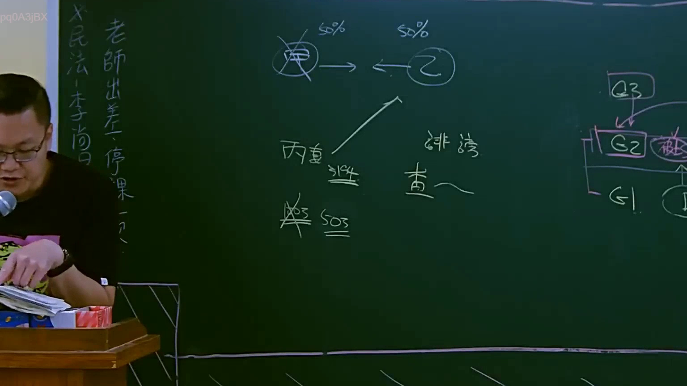

# 🎥 影音教材板書校對筆記
- **來源影片**: [預約 8 2025-04-13 13-54-42-845](file:///J://民法B/ch8/預約 8 2025-04-13 13-54-42-845.mp4)
- **課程分類**: `[民法B`
- **課堂章節**: `ch8]`
- **影片時間戳記**: `00:45:45` (2745 秒)
- **板書類型**: `關係圖/邏輯圖板書`
- **偵測時間**: 2026-07-12 00:44:03

## 🔍 擷取黑板板書對照圖


## 🧠 AI 智慧理解與知識庫演化註記
：
板書內容顯示了一個基於「關係圖/邏輯圖板書」的法律案例結構。以下是詳細的法律分析和條文對位：

1. **原告甲** 向被告乙提出诉讼請求，這表明这是一个基於原告甲對被告乙的權利要求的Legal Case。
2. **第三 parties丙、丁** 作为共同被告加入，這符合民法第184條關於共同诉讼的承认。此條文规定，共同被告加入後，原告诉讼權利不受影響。

箭頭指向不同的法律条文表明了案件中涉及的法律問題：

- 民法第184條：共同诉讼的承认。
- 侵權行為：可能涉及原告甲的權利是否因被告乙的行動而受影響。
- 消滅時效：可能涉及某些權利或債務在特定條件下會自动消滅的情況。

## 📊 可編輯之 Mermaid 關係流程圖
```mermaid
：
```mermaid
graph TD
    A["原告甲"] --> B["被告乙"]
    B --> C["民法第184條：共同诉讼的承认"]
    B --> D["侵權行為"]
    B --> E["消滅時效"]
```

## ✍️ 操作者手動校對修改區
<!-- 您可以直接修改上方的文字或調整 Mermaid 區塊中的節點，Obsidian 會即時重新渲染 -->
- [ ] 欄位結構與法律邏輯已校對無誤。
- **校對筆記**: 
