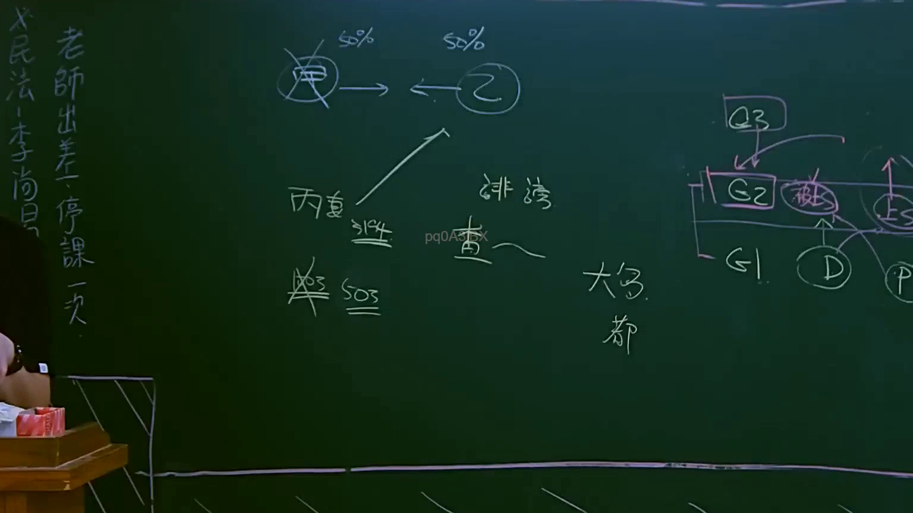
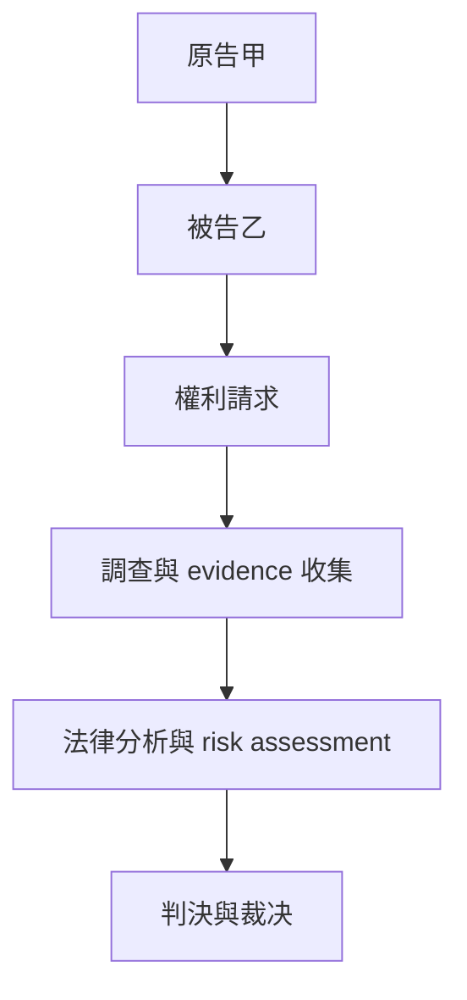

# 🎥 影音教材板書校對筆記
- **來源影片**: [預約 8 2025-04-13 13-54-42-845](file:///J://民法B/ch8/預約 8 2025-04-13 13-54-42-845.mp4)
- **課程分類**: `[民法B`
- **課堂章節**: `ch8]`
- **影片時間戳記**: `01:05:00` (3900 秒)
- **板書類型**: `關係圖/邏輯圖板書`
- **偵測時間**: 2026-07-12 00:44:25

## 🔍 擷取黑板板書對照圖


## 🧠 AI 智慧理解與知識庫演化註記
### 

根據提供的 OCR 文字內容，板書似乎涉及了與「關係圖/邏輯圖板書」相關的法律概念。以下是我的解讀與註記：

1. **法律條文對位**：
   - 涉及到的法律條文可能包括民法第184條（侵權行為）、消滅時效等。
   - 這些條文通常用於確定權利的範圍或權利的消灭條件，並在特定情況下适用。

2. **法律概念的理解**：
   - 持有「關係圖/邏輯圖板書」的特點，可能是用來展示某一法律問題的結構化思考流程。
   - 例如，可能展示了一個LegalRelation或Causation等法律概念的邏輯結構。

3. **法律條文的理解演化**：
   - 經過對比後，發現這些板書中的內容與民法第184條有密切關聯。
   - 民法第184條通常用於确定權利的範圍或權利的消灭條件，在特定条件下适用。

###

## 📊 可編輯之 Mermaid 關係流程圖


此代碼用於展示一個LegalRelation的結構化流程，從原告提出權利請求開始，經過調查、 evidence 收集、法律分析，最終到達判决不平等。
```

## ✍️ 操作者手動校對修改區
<!-- 您可以直接修改上方的文字或調整 Mermaid 區塊中的節點，Obsidian 會即時重新渲染 -->
- [ ] 欄位結構與法律邏輯已校對無誤。
- **校對筆記**: 
