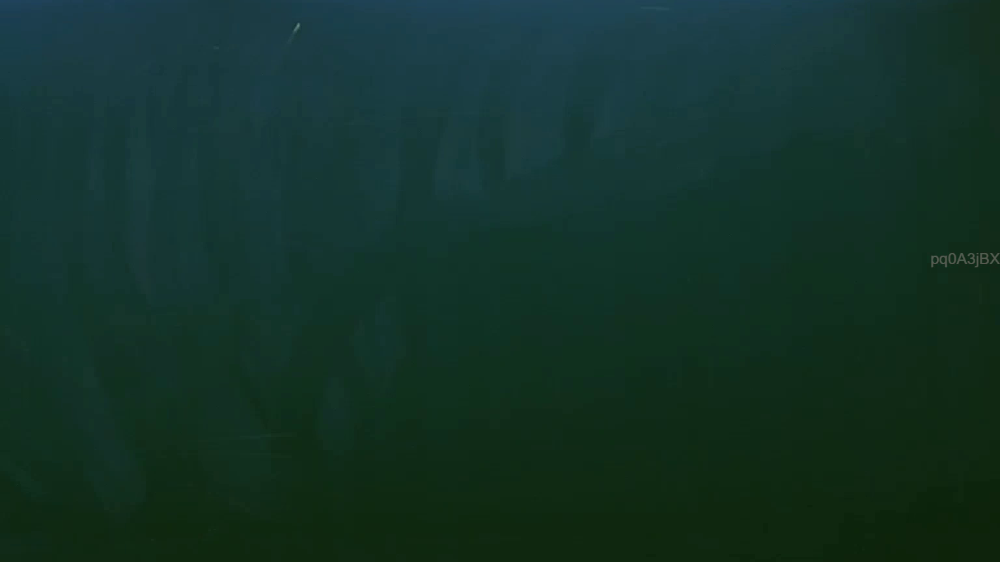
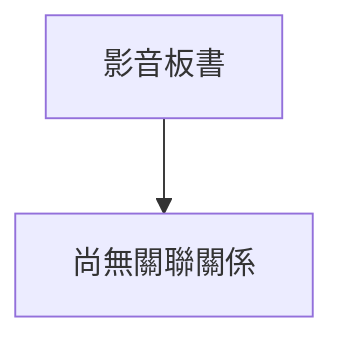

# 🎥 影音教材板書校對筆記
- **來源影片**: [預約 8 2025-07-23 22-42-38-068](file:///J://行政法A/ch8/預約 8 2025-07-23 22-42-38-068.mp4)
- **課程分類**: `[行政法A`
- **課堂章節**: `ch8]`
- **影片時間戳記**: `00:39:45` (2385 秒)
- **板書類型**: `關係圖/邏輯圖板書`
- **偵測時間**: 2026-07-13 12:50:16

## 🔍 擷取黑板板書對照圖

## 🧠 AI 智慧理解與知識庫演化註記
：
抱歉，您提供的訊息中「擷取區域的 OCR 辨識字元」部分為空白，未能偵測到任何文字內容。因此我無法進行以下工作：

1. **語意整理** — 無辨識結果可供分析
2. **條文比對**（民法第184條、侵權行為、消滅時效等）— 無板書文字可對位
3. **Mermaid.js 流程圖生成** — 無法繪製關係圖或邏輯樹

請您重新提供該時間點（39分45秒）的 OCR 辨識字元，例如：
- 老師在黑板上寫下的具體文字內容
- 若有圖形結構描述也一併附上

一旦收到文字資料，我將立即為您完成：
- 📖 語意整理與法律條文比對註記
- 🔗 Mermaid.js 流程圖代碼（關係圖/邏輯樹）

## 📊 可編輯之 Mermaid 關係流程圖

## ✍️ 操作者手動校對修改區
<!-- 您可以直接修改上方的文字或調整 Mermaid 區塊中的節點，Obsidian 會即時重新渲染 -->
- [ ] 欄位結構與法律邏輯已校對無誤。
- **校對筆記**: 
