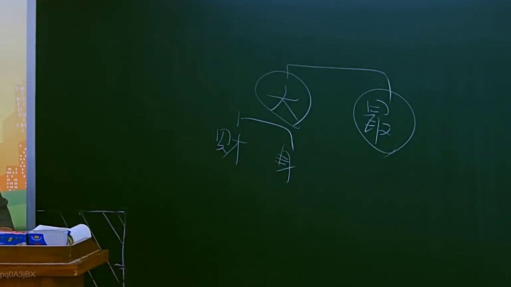

# 🎥 影音教材板書校對筆記
- **來源影片**: [預約 8 2025-07-23 22-42-38-068](file:///J://行政法A/ch8/預約 8 2025-07-23 22-42-38-068.mp4)
- **課程分類**: `[行政法A`
- **課堂章節**: `ch8]`
- **影片時間戳記**: `00:46:45` (2805 秒)
- **板書類型**: `關係圖/邏輯圖板書`
- **偵測時間**: 2026-07-13 12:50:58

## 🔍 擷取黑板板書對照圖


## 🧠 AI 智慧理解與知識庫演化註記
：
您好，您提供的訊息中「擷取區域的 OCR 辨識字元」部分為空白（未偵測到任何文字），因此我目前無法進行以下工作：

1. **語意整理** — 無辨識文字可供分析。
2. **條文比對**（如民法第184條侵權行為、消滅時效等）— 無內容可對位。
3. **Mermaid.js 流程圖生成** — 無法判斷板書結構與邏輯關係。

---

## 📊 可編輯之 Mermaid 關係流程圖
```mermaid
：
（待提供 OCR 文字後方可生成）

---

📌 **請您補充以下任一方式，我即可協助完成：**

- **直接貼上 OCR 辨識出的文字內容**（即使有錯字也無妨，我會自行校正）。
- **描述板書的大致結構**（例如：「左側寫著『原告甲』，右側寫著『被告乙』，中間用箭頭連接……」），我亦可依此重建 Mermaid 圖。

一旦收到文字內容，我將立即為您完成語意整理、條文比對註記與 Mermaid 代碼生成。
```

## ✍️ 操作者手動校對修改區
<!-- 您可以直接修改上方的文字或調整 Mermaid 區塊中的節點，Obsidian 會即時重新渲染 -->
- [ ] 欄位結構與法律邏輯已校對無誤。
- **校對筆記**: 
