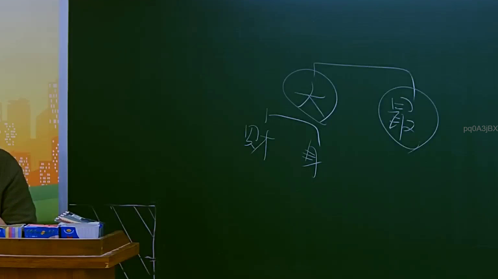
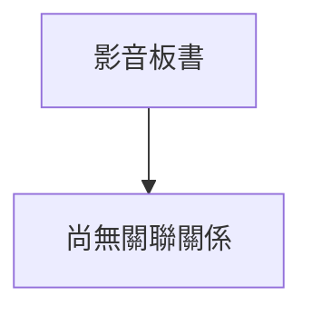

# 🎥 影音教材板書校對筆記
- **來源影片**: [預約 8 2025-07-23 22-42-38-068](file:///J://行政法A/ch8/預約 8 2025-07-23 22-42-38-068.mp4)
- **課程分類**: `[行政法A`
- **課堂章節**: `ch8]`
- **影片時間戳記**: `01:08:15` (4095 秒)
- **板書類型**: `關係圖/邏輯圖板書`
- **偵測時間**: 2026-07-13 12:51:21

## 🔍 擷取黑板板書對照圖

## 🧠 AI 智慧理解與知識庫演化註記
：

您好，您的訊息中「擷取區域的 OCR 辨識字元如下」之後**未附實際文字內容**。OCR 辨識結果為空白，我無法進行後續的法律條文比對與 Mermaid 圖表生成。

請您補充以下任一方式之一：
1. **直接貼上 OCR 辨識出的文字**（例如：「侵權行為、消滅時效、民法第184條...」）
2. **描述黑板上的內容**（例如：老師寫了哪些關鍵字、箭頭方向、圖形結構等）

一旦收到實際內容，我將立即為您完成：
- 語意整理與臺灣現行法律條文比對註記
- Mermaid.js 流程圖代碼生成

期待您的補充！

## 📊 可編輯之 Mermaid 關係流程圖

## ✍️ 操作者手動校對修改區
<!-- 您可以直接修改上方的文字或調整 Mermaid 區塊中的節點，Obsidian 會即時重新渲染 -->
- [ ] 欄位結構與法律邏輯已校對無誤。
- **校對筆記**: 
