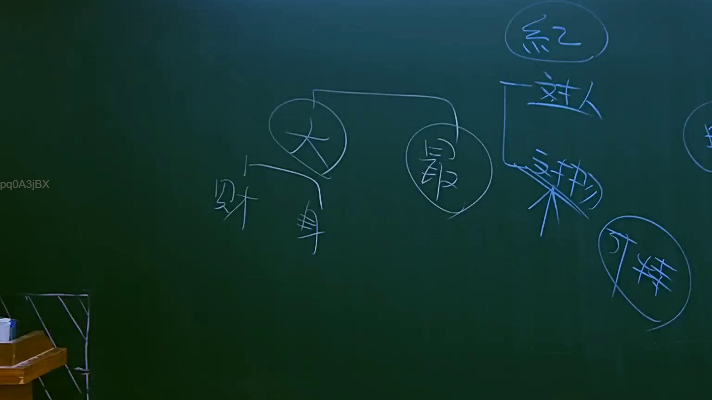
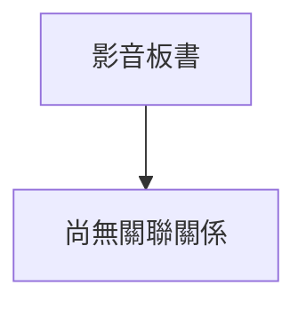

# 🎥 影音教材板書校對筆記
- **來源影片**: [預約 8 2025-07-23 22-42-38-068](file:///J://行政法A/ch8/預約 8 2025-07-23 22-42-38-068.mp4)
- **課程分類**: `[行政法A`
- **課堂章節**: `ch8]`
- **影片時間戳記**: `01:11:45` (4305 秒)
- **板書類型**: `關係圖/邏輯圖板書`
- **偵測時間**: 2026-07-13 12:51:42

## 🔍 擷取黑板板書對照圖

## 🧠 AI 智慧理解與知識庫演化註記
您好！我注意到您的訊息中「擷取區域的 OCR 辨識字元」部分似乎為空白或未能正確顯示。目前我無法看到實際的板書文字內容，因此無法進行後續的法律條文比對與 Mermaid 圖表生成。

請您重新提供以下資訊：

1. **OCR 辨識出的板書文字**（請完整貼上）
2. （若已有）擷取區域的圖片或截圖

一旦收到文字內容，我將立即為您完成：

- 📖 **知識庫比對與理解演化註記** — 針對板書內容與臺灣現行法律條文（民法第184條、侵權行為、消滅時效等）進行語意整理與條文對位
- 📊 **Mermaid.js 流程圖代碼** — 根據分類類型生成對應的邏輯關係圖

請補充 OCR 文字，我隨時待命！

## 📊 可編輯之 Mermaid 關係流程圖

## ✍️ 操作者手動校對修改區
<!-- 您可以直接修改上方的文字或調整 Mermaid 區塊中的節點，Obsidian 會即時重新渲染 -->
- [ ] 欄位結構與法律邏輯已校對無誤。
- **校對筆記**: 
