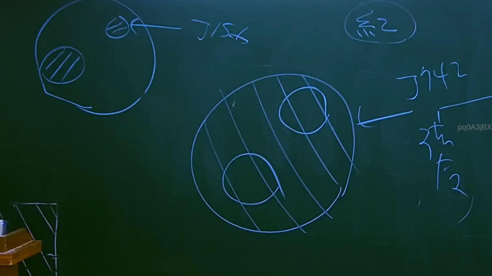
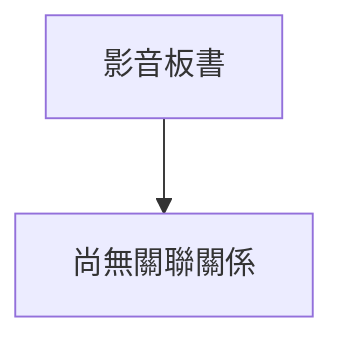

# 🎥 影音教材板書校對筆記
- **來源影片**: [預約 8 2025-07-23 22-42-38-068](file:///J://行政法A/ch8/預約 8 2025-07-23 22-42-38-068.mp4)
- **課程分類**: `[行政法A`
- **課堂章節**: `ch8]`
- **影片時間戳記**: `01:18:15` (4695 秒)
- **板書類型**: `關係圖/邏輯圖板書`
- **偵測時間**: 2026-07-13 12:52:04

## 🔍 擷取黑板板書對照圖

## 🧠 AI 智慧理解與知識庫演化註記
：

您好！您提供的訊息中，OCR 辨識字元區域為空白（未擷取到任何文字），因此我無法進行後續的語意整理、條文比對或 Mermaid 圖表生成。

請您重新提供該時間點（78分15秒）截圖中的 OCR 辨識結果文字，我再依以下流程為您處理：

1. **語意整理** → 將板書文字歸納為法律概念結構
2. **條文比對** → 與民法第184條、侵權行為責任、消滅時效等現行法條進行對位分析，並撰寫「知識庫比對與理解演化註記」
3. **Mermaid.js 圖表生成** → 依板書邏輯關係（關係圖/文字板書）輸出對應的 Mermaid 程式碼

請補充 OCR 辨識字元後，我將立即為您完成分析。

## 📊 可編輯之 Mermaid 關係流程圖

## ✍️ 操作者手動校對修改區
<!-- 您可以直接修改上方的文字或調整 Mermaid 區塊中的節點，Obsidian 會即時重新渲染 -->
- [ ] 欄位結構與法律邏輯已校對無誤。
- **校對筆記**: 
