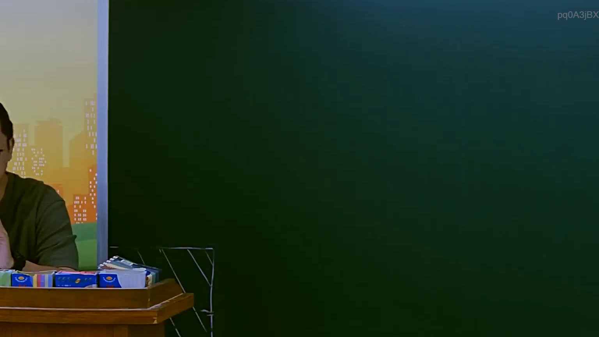
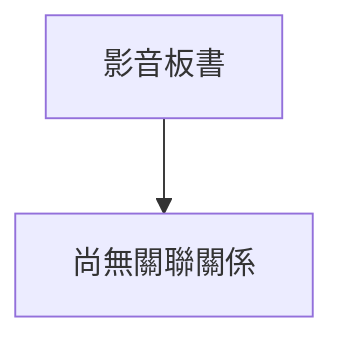

# 🎥 影音教材板書校對筆記
- **來源影片**: [預約 8 2025-07-23 22-42-38-068](file:///J://行政法A/ch8/預約 8 2025-07-23 22-42-38-068.mp4)
- **課程分類**: `[行政法A`
- **課堂章節**: `ch8]`
- **影片時間戳記**: `01:22:45` (4965 秒)
- **板書類型**: `關係圖/邏輯圖板書`
- **偵測時間**: 2026-07-13 12:52:50

## 🔍 擷取黑板板書對照圖

## 🧠 AI 智慧理解與知識庫演化註記
：

您好！您的訊息中「擷取區域的 OCR 辨識字元」部分為空白，未實際附上辨識出的文字內容。因此我無法進行以下工作：

1. **語意整理** — 無原始文字可分析
2. **條文比對**（民法第184條、侵權行為責任、消滅時效等）— 需先確認板書主題
3. **Mermaid.js 流程圖生成** — 需依實際邏輯關係繪製

---

請您補充提供 OCR 辨識出的文字內容，我將立即為您完成：

- 📖 語意整理與法律條文對位註記
- 🔗 Mermaid.js 關係圖/邏輯圖代碼（含雙引號節點格式）

例如您可以貼上類似這樣的文字：
> 「甲侵權行為致乙損害，依民法第184條第1項前段...」

收到後我會馬上處理！

## 📊 可編輯之 Mermaid 關係流程圖

## ✍️ 操作者手動校對修改區
<!-- 您可以直接修改上方的文字或調整 Mermaid 區塊中的節點，Obsidian 會即時重新渲染 -->
- [ ] 欄位結構與法律邏輯已校對無誤。
- **校對筆記**: 
