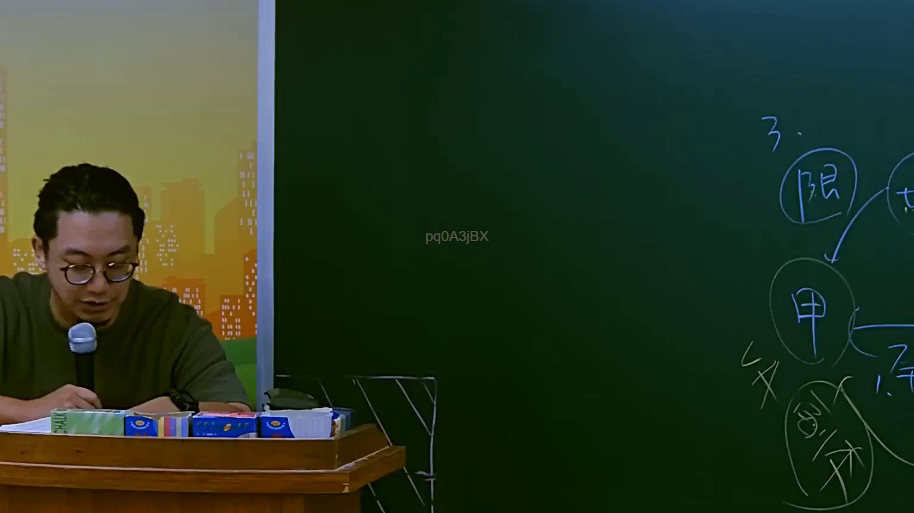
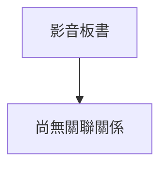

# 🎥 影音教材板書校對筆記
- **來源影片**: [預約 8 2025-07-23 22-42-38-068](file:///J://行政法A/ch8/預約 8 2025-07-23 22-42-38-068.mp4)
- **課程分類**: `[行政法A`
- **課堂章節**: `ch8]`
- **影片時間戳記**: `01:56:00` (6960 秒)
- **板書類型**: `關係圖/邏輯圖板書`
- **偵測時間**: 2026-07-13 12:54:08

## 🔍 擷取黑板板書對照圖

## 🧠 AI 智慧理解與知識庫演化註記
：

您好！您提供的訊息中，「擷取區域的 OCR 辨識字元」部分為空白，未實際顯示任何文字內容。因此我無法進行以下工作：

1. **語意整理** — 無辨識字元可供分析
2. **條文比對**（民法第184條、侵權行為、消滅時效等）— 無板書內容可對位
3. **Mermaid.js 流程圖生成** — 無結構資料可繪製

---

請您補充以下任一方式，我即可立即為您完成分析：

- **直接貼上 OCR 辨識出的文字**（即使有錯字也無妨）
- **描述板書上的關鍵詞或邏輯關係**（例如：「原告甲 vs 被告乙、侵權行為、消滅時效」等）
- **上傳截圖**，我可自行進行 OCR 辨識

一旦取得內容，我將立即為您生成完整的法律知識庫比對註記與 Mermaid.js 流程圖代碼。

## 📊 可編輯之 Mermaid 關係流程圖

## ✍️ 操作者手動校對修改區
<!-- 您可以直接修改上方的文字或調整 Mermaid 區塊中的節點，Obsidian 會即時重新渲染 -->
- [ ] 欄位結構與法律邏輯已校對無誤。
- **校對筆記**: 
