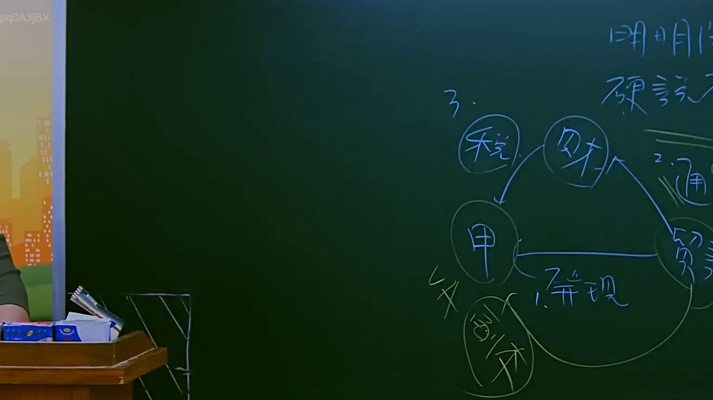
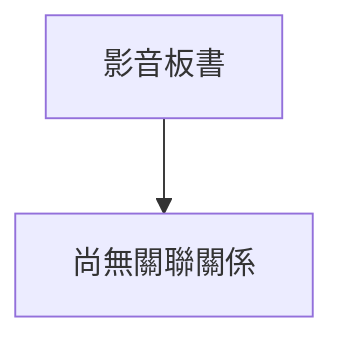

# 🎥 影音教材板書校對筆記
- **來源影片**: [預約 8 2025-07-23 22-42-38-068](file:///J://行政法A/ch8/預約 8 2025-07-23 22-42-38-068.mp4)
- **課程分類**: `[行政法A`
- **課堂章節**: `ch8]`
- **影片時間戳記**: `02:02:15` (7335 秒)
- **板書類型**: `關係圖/邏輯圖板書`
- **偵測時間**: 2026-07-13 12:54:30

## 🔍 擷取黑板板書對照圖

## 🧠 AI 智慧理解與知識庫演化註記
：

您好，我注意到您的訊息中「擷取區域的 OCR 辨識字元如下：」之後**沒有實際的文字內容**。OCR 辨識結果似乎為空或遺漏。

為了協助您完成以下工作，我需要您提供：

1. **板書上的具體文字/圖示內容**（請貼上 OCR 辨識出的字串）
2. **如有圖片截圖**，也可一併上傳讓我直接辨識

一旦收到實際的板書文字，我將立即為您執行：

- 🔍 **語意整理與法律條文比對**（如民法第184條侵權行為、消滅時效等）
- 📊 **生成 Mermaid.js 流程圖代碼**（關係圖/邏輯圖或條列式邏輯樹）

請補充 OCR 辨識結果，我隨時待命協助！

## 📊 可編輯之 Mermaid 關係流程圖

## ✍️ 操作者手動校對修改區
<!-- 您可以直接修改上方的文字或調整 Mermaid 區塊中的節點，Obsidian 會即時重新渲染 -->
- [ ] 欄位結構與法律邏輯已校對無誤。
- **校對筆記**: 
