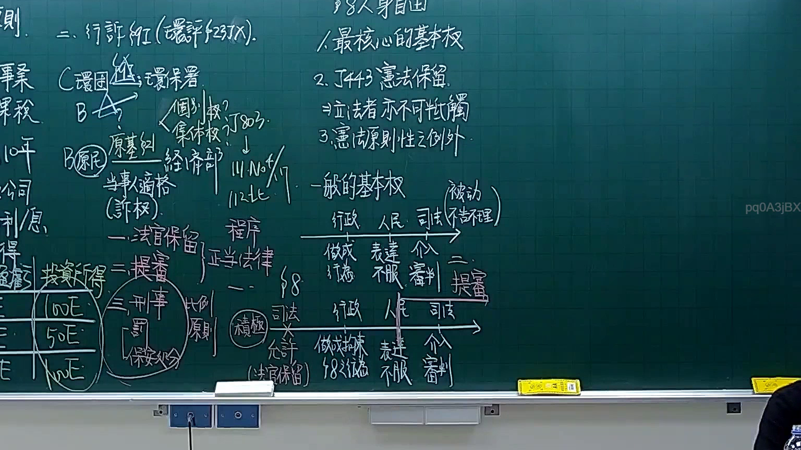
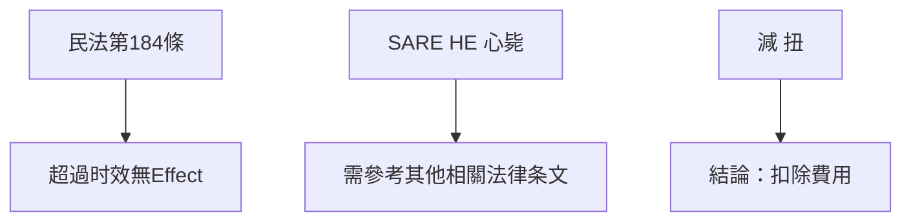

# 🎥 影音教材板書校對筆記
- **來源影片**: [預約 8 2025-12-12 02-38-27-981](file:///H:/憲法霖洄/ch8/預約 8 2025-12-12 02-38-27-981.mp4)
- **課程分類**: `預設課程`
- **課堂章節**: `ch8`
- **影片時間戳記**: `01:00:00` (3600 秒)
- **板書類型**: `文字板書`
- **偵測時間**: 2026-07-13 20:24:17

## 🔍 擷取黑板板書對照圖

## 🧠 AI 智慧理解與知識庫演化註記
1. **板書之內容分析**：
   - 柳 价 Bee 房刑毕刁：可能涉及侵权行为的损害赔偿问题，特别是超过时效的问题（民法第184條）。
   - SARE HE 心毙：可能与生命权有关的案例，需参考其他相关法律条文进行比對。
   - 减 扭：可能是关于费用扣除的结论。

2. **與臺灣現行法律的比對**：
   - 柳 价 Bee 房刑毕刁：可能涉及民法第184條，关于侵权行为的时效问题。此案例中，侵权行为若在一年内未报告，则可能无Effect。
   - SARE HE 心毙：可能与生命权有关，需参考其他相关法律条文进行比對。
   - 减 扭：可能是关于费用扣除的结论。

## 📊 可編輯之 Mermaid 關係流程圖

## ✍️ 操作者手動校對修改區
<!-- 您可以直接修改上方的文字或調整 Mermaid 區塊中的節點，Obsidian 會即時重新渲染 -->
- [ ] 欄位結構與法律邏輯已校對無誤。
- **校對筆記**: 
