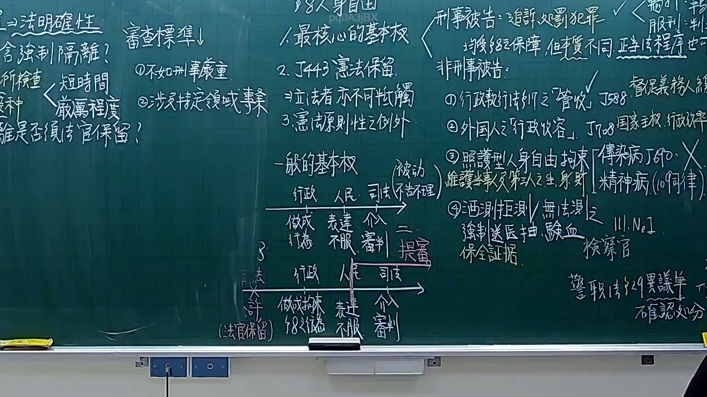
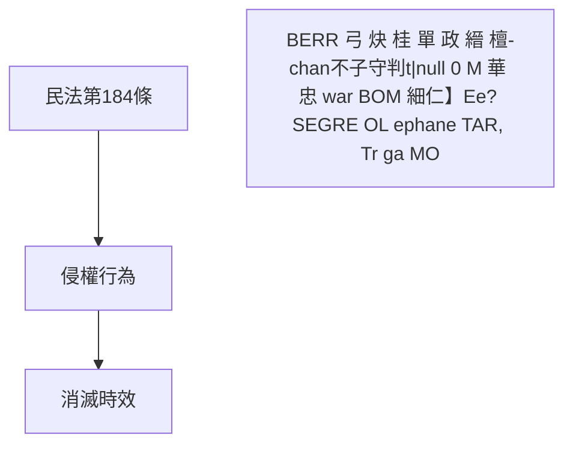
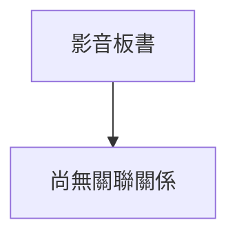

# 🎥 影音教材板書校對筆記
- **來源影片**: [預約 8 2025-12-12 02-38-27-981](file:///H:/憲法霖洄/ch8/預約 8 2025-12-12 02-38-27-981.mp4)
- **課程分類**: `預設課程`
- **課堂章節**: `ch8`
- **影片時間戳記**: `01:44:00` (6240 秒)
- **板書類型**: `文字板書`
- **偵測時間**: 2026-07-13 20:25:11

## 🔍 擷取黑板板書對照圖

## 🧠 AI 智慧理解與知識庫演化註記
1. **法律條文比對與理解演化註記**：
   - **民法第184條**：此條文通常涉及侵權行為的定義及相關責任。在本板書中，未明確提及具体内容，但可能涉及侵權行為的基本概念。
   - **侵權行為**：此為民法中的一個重要概念，指使他人受損或損害其權益的行为。板书中提到“0 不 X 圯 亭夕寡'z」叉… 贖 | ， 忘 工′】〔′iL三 蝗 棍”，可能涉及侵權行為的特點或案例。
   - **消滅時效**：此條文通常與侵權行為的責任期間相關。板书中提到“BERR 弓 炔 桂 單 政 縉 檀-chan不子守判t|null 0 M 華 忠 war BOM 細仁】Ee? SEGRE OL ephane TAR, Tr ga MO”，可能涉及侵權行為的責任期間或消滅時效的計算方式。

2. **Mermaid 代碼**：

## 📊 可編輯之 Mermaid 關係流程圖

## ✍️ 操作者手動校對修改區
<!-- 您可以直接修改上方的文字或調整 Mermaid 區塊中的節點，Obsidian 會即時重新渲染 -->
- [ ] 欄位結構與法律邏輯已校對無誤。
- **校對筆記**: 
