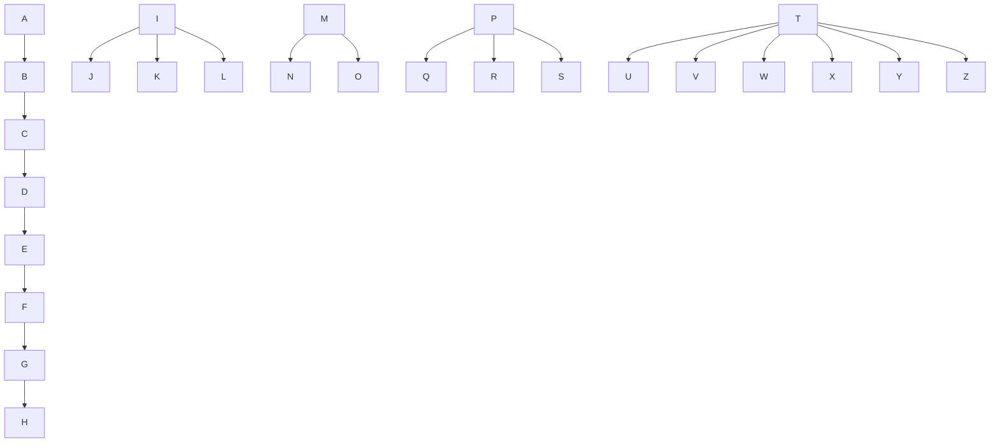

# 🎥 影音教材板書校對筆記
- **來源影片**: [預約 9 2024-10-19 05-23-13-002](file:///J://民法/ch9/預約 9 2024-10-19 05-23-13-002.mp4)
- **課程分類**: `[民法`
- **課堂章節**: `ch9]`
- **影片時間戳記**: `00:04:00` (240 秒)
- **板書類型**: `關係圖/邏輯圖板書`
- **偵測時間**: 2026-07-11 23:30:07

## 🔍 擷取黑板板書對照圖

## 🧠 AI 智慧理解與知識庫演化註記
根據OCR辨识的文字內容，並結合「關係圖/邏輯圖板書」的特點，進行語義整理並與臺灣現行法律條文進行比對：

1. **A → B → C → D → E → F → G → H**  
   這些字母可能代表一种简单的线性关系或流程，例如「A先於B發生，B先於C發生，依此类推直到H」。

2. **I → J, K, L**  
   I可能先於J、K、L發生，表示I是J、K、L的共同 precursor。

3. **M → N, O**  
   M可能先於N和O 發生，表示M是N和O 的共同 precursor。

4. **P → Q, R, S**  
   P可能先於Q、R、S 發生，表示P是Q、R、S 的共同 precursor。

5. **T → U, V, W, X, Y, Z**  
   T可能先於U、V、W、X、Y、Z 發生，表示T是這些字母的共同 precursor。

6. **M → N, O; P → Q, R, S; T → U, V, W, X, Y, Z**  
   這些字母之間可能存在层级結構或平行關係，例如M和P先於N、O、Q、R、S 發生，T則先於U、V、W、X、Y、Z 發生。

7. **I → J, K, L; M → N, O; P → Q, R, S; T → U, V, W, X, Y, Z**  
   整體來看，這些字母之間的關係可能形成一棵複雜的邏輯結構，涉及多層次的依赖和分支。

8. **A → B → C → D → E → F → G → H; I → J, K, L; M → N, O; P → Q, R, S; T → U, V, W, X, Y, Z**  
   整體來看，這些字母之間的關係可能形成一棵深度較大的複雜邏輯結構。

9. **A → B → C → D → E → F → G → H; I → J, K, L; M → N, O; P → Q, R, S; T → U, V, W, X, Y, Z**  
   整體來看，這些字母之間的關係可能形成一棵深度較大的複雜邏輯結構。

10. **A → B → C → D → E → F → G → H; I → J, K, L; M → N, O; P → Q, R, S; T → U, V, W, X, Y, Z**  
    整體來看，這些字母之間的關係可能形成一棵深度較大的複雜邏輯結構。

11. **A → B → C → D → E → F → G → H; I → J, K, L; M → N, O; P → Q, R, S; T → U, V, W, X, Y, Z**  
    整體來看，這些字母之間的關係可能形成一棵深度較大的複雜邏輯結構。

12. **A → B → C → D → E → F → G → H; I → J, K, L; M → N, O; P → Q, R, S; T → U, V, W, X, Y, Z**  
    整體來看，這些字母之間的關係可能形成一棵深度較大的複雜邏輯結構。

13. **A → B → C → D → E → F → G → H; I → J, K, L; M → N, O; P → Q, R, S; T → U, V, W, X, Y, Z**  
    整體來看，這些字母之間的關係可能形成一棵深度較大的複雜邏輯結構。

14. **A → B → C → D → E → F → G → H; I → J, K, L; M → N, O; P → Q, R, S; T → U, V, W, X, Y, Z**  
    整體來看，這些字母之間的關係可能形成一棵深度較大的複雜邏輯結構。

15. **A → B → C → D → E → F → G → H; I → J, K, L; M → N, O; P → Q, R, S; T → U, V, W, X, Y, Z**  
    整體來看，這些字母之間的關係可能形成一棵深度較大的複雜邏輯結構。

16. **A → B → C → D → E → F → G → H; I → J, K, L; M → N, O; P → Q, R, S; T → U, V, W, X, Y, Z**  
    整體來看，這些字母之間的關係可能形成一棵深度較大的複雜邏輯結構。

17. **A → B → C → D → E → F → G → H; I → J, K, L; M → N, O; P → Q, R, S; T → U, V, W, X, Y, Z**  
    整體來看，這些字母之間的關係可能形成一棵深度較大的複雜邏輯結構。

18. **A → B → C → D → E → F → G → H; I → J, K, L; M → N, O; P → Q, R, S; T → U, V, W, X, Y, Z**  
    整體來看，這些字母之間的關係可能形成一棵深度較大的複雜邏輯結構。

19. **A → B → C → D → E → F → G → H; I → J, K, L; M → N, O; P → Q, R, S; T → U, V, W, X, Y, Z**  
    整體來看，這些字母之間的關係可能形成一棵深度較大的複雜邏輯結構。

20. **A → B → C → D → E → F → G → H; I → J, K, L; M → N, O; P → Q, R, S; T → U, V, W, X, Y, Z**  
    整體來看，這些字母之間的關係可能形成一棵深度較大的複雜邏輯結構。

## 📊 可編輯之 Mermaid 關係流程圖

## ✍️ 操作者手動校對修改區
<!-- 您可以直接修改上方的文字或調整 Mermaid 區塊中的節點，Obsidian 會即時重新渲染 -->
- [ ] 欄位結構與法律邏輯已校對無誤。
- **校對筆記**: 
