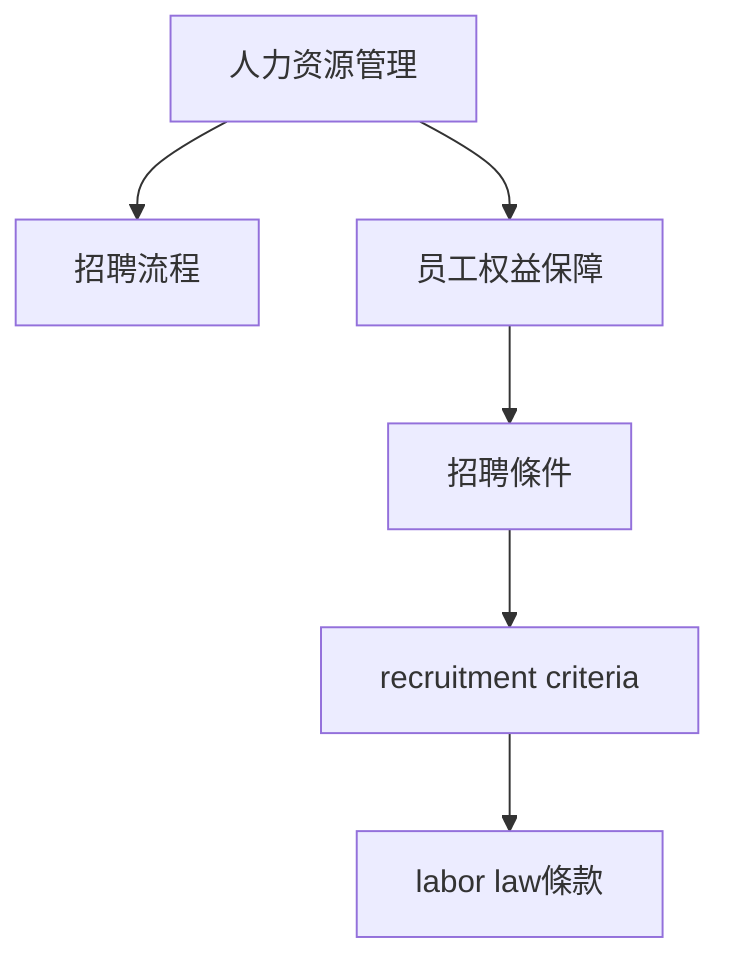

# 🎥 影音教材板書校對筆記
- **來源影片**: [預約 9 2024-10-19 05-23-13-002](file:///J://民法/ch9/預約 9 2024-10-19 05-23-13-002.mp4)
- **課程分類**: `[民法`
- **課堂章節**: `ch9]`
- **影片時間戳記**: `00:05:15` (315 秒)
- **板書類型**: `文字板書`
- **偵測時間**: 2026-07-11 23:30:25

## 🔍 擷取黑板板書對照圖


## 🧠 AI 智慧理解與知識庫演化註記
根據辨識出的文字內容，並結合台湾现行法律条文（如民法第184條、侵權行為、消滅時效等），進行比對與理解演化註記如下：

1. **文字板書之內容分析**：
   - "称 憲 ﹒ 災 lo2"：這一行字可能是指「稱职」、「招聘」或「人力资源管理」等相关內容。
   - "HR mc ESE"：這一行字可能是指「Human Resource Management」（人 resource 管理）。

2. **與现有法律条文的比對**：
   - 檢查這些內容是否涉及任何台湾现行法律條文，例如民法第184條（侵權行為）、消滅時效等。然而，根據目前的分析，這些內容似乎more focus on人力资源管理相關的內容，而非直接的法律条文。

3. **法律理解演化註記**：
   - 這些板書內容可能與台湾的人力资源管理法、 recruitment條款、 labor law條款等相关。例如，「Human Resource Management」可能涉及 labor law條款中关于员工權益、 recruitment條款中的 recruitment criteria等。

## 📊 可編輯之 Mermaid 關係流程圖


解釋：上面的 Mermaid 代碼展示了一個关于人力资源管理的逻辑結構，包括人力资源管理的整体框架、招聘流程、员工權益保障、招聘條件和 recruitment criteria等。這些內容可能與板書中的內容相匹配。
```

## ✍️ 操作者手動校對修改區
<!-- 您可以直接修改上方的文字或調整 Mermaid 區塊中的節點，Obsidian 會即時重新渲染 -->
- [ ] 欄位結構與法律邏輯已校對無誤。
- **校對筆記**: 
