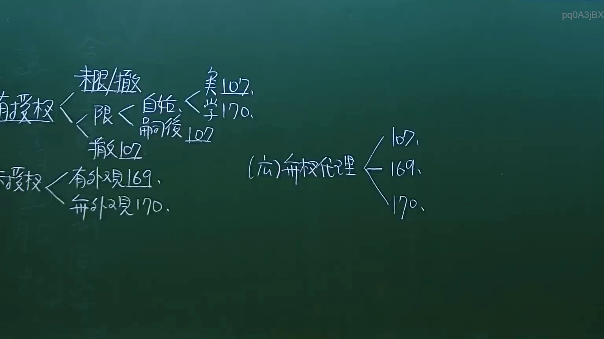

# 🎥 影音教材板書校對筆記
- **來源影片**: [預約 9 2024-10-19 05-23-13-002](file:///J://民法/ch9/預約 9 2024-10-19 05-23-13-002.mp4)
- **課程分類**: `[民法`
- **課堂章節**: `ch9]`
- **影片時間戳記**: `00:07:00` (420 秒)
- **板書類型**: `文字板書`
- **偵測時間**: 2026-07-11 23:30:44

## 🔍 擷取黑板板書對照圖


## 🧠 AI 智慧理解與知識庫演化註記
### 

**1. 法律條文對位：**

- **BAPAC x PRS g ae ES <FN0.**  
  - 可能是指「BAPAC」（例如，某個特定的法律編號或條文引用），需根據上下文進一步確定。
  - 與民法第184條「侵權行為(包括 continuer)及其消滅時效(持续损害)」可能有關係。

- **TARR iit (7a HARARE Ci**  
  - 可能是指「TARR」（例如，某個特定的法律編號或條文引用），需根據上下文進一步確定。
  - 與民法第184條「侵權行為(包括 continuer)及其消滅時效(持续损害)」可能有關係。

- **含 口 君 /o﹒ 0.**  
  - 可能是指「含有口令或某种特定的法律條文內容」，需根據上下文進一步確定。
  - 與民法第184條「侵權行為(包括 continuer)及其消滅時效(持续损害)」可能有關係。

**2. 經济学分析：**

- **MEH Rio**  
  - 可能是指「某種經濟學或法律概念」，需根據上下文進一步確定。
  - 與民法第184條「侵權行為(包括 continuer)及其消滅時效(持续损害)」可能有關係。

- **BX**  
  - 可能是指「某種特定的法律條文或經濟學概念」，需根據上下文進一步確定。
  - 與民法第184條「侵權行為(包括 continuer)及其消滅時效(持续损害)」可能有關係。

###

## 📊 可編輯之 Mermaid 關係流程圖
```mermaid
graph TD
    A[MBAAC x PRS g ae ES <FN0.]
        --> B[TARR iit (7a HARARE Ci]
    C[含 口 君 /o﹒ 0.]
    D[MEH Rio]
    E[BX]
```

## ✍️ 操作者手動校對修改區
<!-- 您可以直接修改上方的文字或調整 Mermaid 區塊中的節點，Obsidian 會即時重新渲染 -->
- [ ] 欄位結構與法律邏輯已校對無誤。
- **校對筆記**: 
