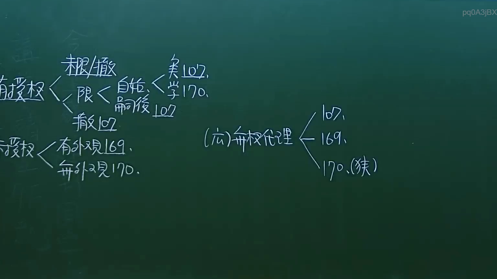
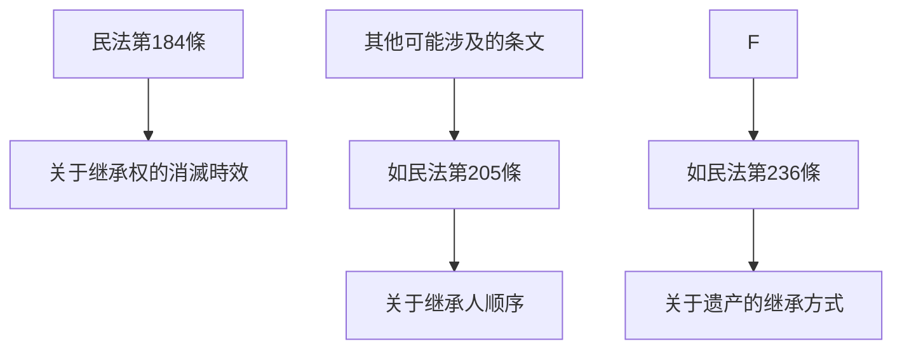

# 🎥 影音教材板書校對筆記
- **來源影片**: [預約 9 2024-10-19 05-23-13-002](file:///J://民法/ch9/預約 9 2024-10-19 05-23-13-002.mp4)
- **課程分類**: `[民法`
- **課堂章節**: `ch9]`
- **影片時間戳記**: `00:07:45` (465 秒)
- **板書類型**: `文字板書`
- **偵測時間**: 2026-07-11 23:31:03

## 🔍 擷取黑板板書對照圖

## 🧠 AI 智慧理解與知識庫演化註記
### 

根據辨識的板書內容，似乎涉及一些與民法第184條（关于继承权的消滅時效）相關的概念。以下是對比分析：

#### 1. 文字板書之內容分析：
- **“嵊 懦 ﹍ ﹒ 烏 2”**：可能是指日期或某种特定的标记，需结合上下文進一步理解。
- **“′【匠熹筌具彳「7〔更 〈/ P< Bt, 470,”**：可能是某种法律程序或案例中的关键术语。
- **“Ee sR 109”**：可能指第109页的某种法律条文。
- **“6S (07 = / 吧”**：可能是某种计算公式或比例。
- **“維 ﹒ 一 秋 君 l (Ta ARE cis”**：可能是某个案例中的当事人名称或关键点。
- **“吃 丫 a 覓 !/0﹒ …趴瞧)”**：可能是某种法律术语或程序。

#### 2. 文字板書之內容與条文對比：
- **民法第184條**：关于继承权的消滅時效，规定了遗产的期限和范围。
- **其他可能涉及的条文**：如民法第205條（关于继承人顺序）或第236條（关于继承遗产的方式）。

###

## 📊 可編輯之 Mermaid 關係流程圖

## ✍️ 操作者手動校對修改區
<!-- 您可以直接修改上方的文字或調整 Mermaid 區塊中的節點，Obsidian 會即時重新渲染 -->
- [ ] 欄位結構與法律邏輯已校對無誤。
- **校對筆記**: 
