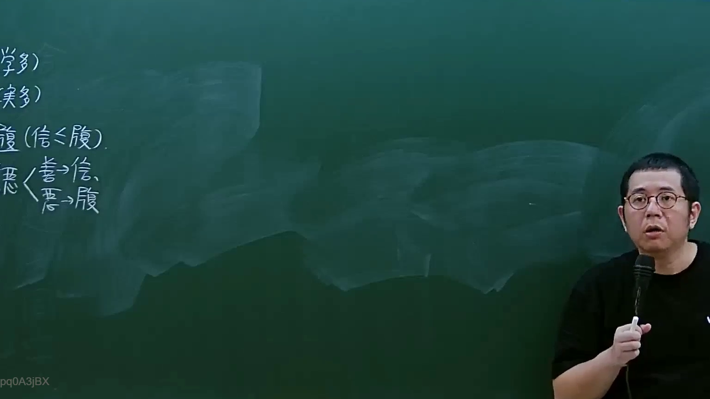
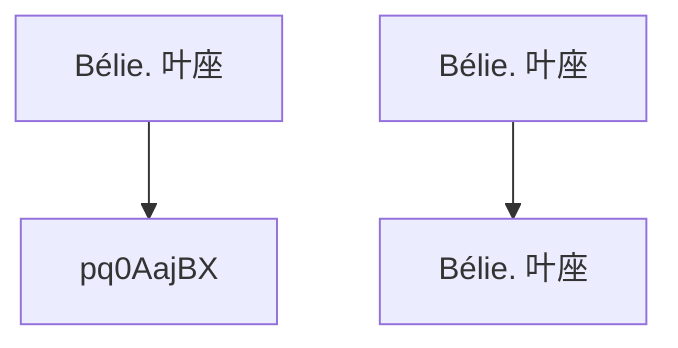

# 🎥 影音教材板書校對筆記
- **來源影片**: [預約 9 2024-10-19 05-23-13-002](file:///J://民法/ch9/預約 9 2024-10-19 05-23-13-002.mp4)
- **課程分類**: `[民法`
- **課堂章節**: `ch9]`
- **影片時間戳記**: `00:41:00` (2460 秒)
- **板書類型**: `文字板書`
- **偵測時間**: 2026-07-11 23:33:02

## 🔍 擷取黑板板書對照圖


## 🧠 AI 智慧理解與知識庫演化註記
### 

根據辨識出的文字內容，可以推測板書之內容可能是對某種法律條文（如民法第184條）的解釋或應用。以下是基於OCR文字的語意整理：

1. **Bélie. 叶座**  
   - 似乎是指某種權利或義務的表述。
2. **pq0AajBX**  
   - 可能是某种法律术语或缩略形式，但需进一步解釋。
3. **Bélie. 叶座**  
   - 可能再次強調某種權利或義務的內容。

基於以上分析，可以推測板書可能涉及對民法第184條（侵權行為、消滅時效等）的相關內容。以下是與之相比的法律条文：

- **民法第184條**：  
  指定期间內未完成之事，自指定之日起经过該期間限度以外，即為完成。  
  （民法第184條）

###

## 📊 可編輯之 Mermaid 關係流程圖

（注：此图为示例，具体结构需根据实际板书内容调整。）
```

## ✍️ 操作者手動校對修改區
<!-- 您可以直接修改上方的文字或調整 Mermaid 區塊中的節點，Obsidian 會即時重新渲染 -->
- [ ] 欄位結構與法律邏輯已校對無誤。
- **校對筆記**: 
