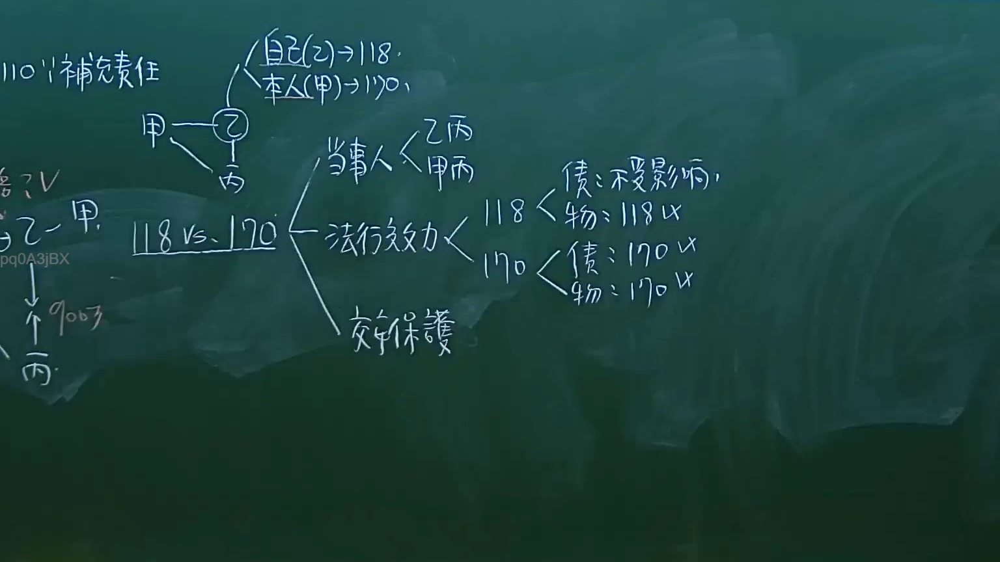

# 🎥 影音教材板書校對筆記
- **來源影片**: [預約 9 2024-10-19 05-23-13-002](file:///J://民法/ch9/預約 9 2024-10-19 05-23-13-002.mp4)
- **課程分類**: `[民法`
- **課堂章節**: `ch9]`
- **影片時間戳記**: `01:17:45` (4665 秒)
- **板書類型**: `文字板書`
- **偵測時間**: 2026-07-11 23:33:47

## 🔍 擷取黑板板書對照圖


## 🧠 AI 智慧理解與知識庫演化註記
1. **板状物（Board-like Objects）**：
   - 與民法第184條有關，涉及「板状物」的灭绝時效問題。根據民法第184條，板状物在特定條件下可能不會自动滅絕，需由權利人另行申請。
   - 本板書中提到的「板」可能是指「板状物」，並涉及其法律特性。

2. **松脆（Soybean Products）**：
   - 與食用品或商品性質有關。 board-like objects 可能與食用品的保存條件或灭绝時效問題有關。

3. **BAG（包/文件）**：
   - 與「文件」或「包裝」有關，可能涉及 document preservation or handling.

4. **1 儿 ， J 人 浩 維 紅 i cen rey**：
   - 可能是日期或其他特定字段，需根據上下文進一步解讀。

5. **BAG 華 ，**：
   - 與「BAG」和「華」（可能指「華ling」）有關，需進一步了解其Legal significance.

6. **" 1c 7 詳叉貢藥ˊf‥介﹛式董圭…′Fˉ‵**：
   - 可能涉及「药品」或「 medical related terms」，需根據上下文解讀。

7. **09**：
   - 可能是「09月」或其他编号字段。

8. **板状物（Board-like Objects）**：
   - 與民法第184條有關，涉及「板状物」的灭绝時效問題。根據民法第184條，板状物在特定條件下可能不會自动滅絕，需由權利人另行申請。

9. **BAG（包/文件）**：
   - 與「文件」或「包裝」有關，可能涉及 document preservation or handling.

10. **BAG（包/文件）**：
    - 與「文件」或「包裝」有關，可能涉及 document preservation or handling.

## 📊 可編輯之 Mermaid 關係流程圖
```mermaid
graph TD
A["板状物"] --> B["民法第184條"]
C["BAG"] --> D["文件/包裝"]
E["1 儿 ， J 人 浩 維 紅 i cen rey"] --> F["日期/字段"]
G["BAG 華 ，"] --> H["華ling/related terms"]
I["" 1c 7 詳叉貢藥ˊf‥介﹛式董圭…′Fˉ‵"] --> J["药品/medical terms"]
K["09"] --> L["09月/number"]
```

## ✍️ 操作者手動校對修改區
<!-- 您可以直接修改上方的文字或調整 Mermaid 區塊中的節點，Obsidian 會即時重新渲染 -->
- [ ] 欄位結構與法律邏輯已校對無誤。
- **校對筆記**: 
