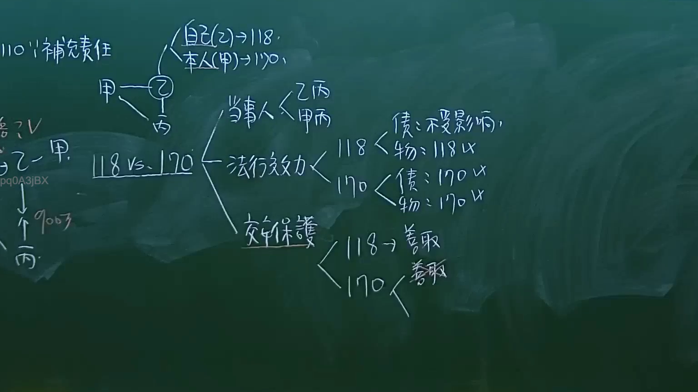

# 🎥 影音教材板書校對筆記
- **來源影片**: [預約 9 2024-10-19 05-23-13-002](file:///J://民法/ch9/預約 9 2024-10-19 05-23-13-002.mp4)
- **課程分類**: `[民法`
- **課堂章節**: `ch9]`
- **影片時間戳記**: `01:19:00` (4740 秒)
- **板書類型**: `文字板書`
- **偵測時間**: 2026-07-11 23:34:05

## 🔍 擷取黑板板書對照圖


## 🧠 AI 智慧理解與知識庫演化註記
：
1. **ABER（侵害行為）**：根據民法第184條，侵害行為是指以 damage、 injury 或other damage 造成他人損失之行為。TS 可能指特定情形下侵害行為的判定。
2. **TS（特定情形）**：在某些特定情形下，侵害行為可能不會trigger 侵權行為，例如特定Legal scenario where ABER may not constitute a trespass.
3. **No ABER (無侵害行為)**：此處可能指某種情況下並未涉及Aber，需根據具體情境判斷。
4. **X．．．**：此处内容不明确，可能是板书中未清晰辨识的部分，需进一步确认。

## 📊 可編輯之 Mermaid 關係流程圖
```mermaid
：
```mermaid
graph TD
    A[民法第184條] --> B[侵害行為]
    C[TS][特定情形] --> D[可能不會trigger 侵權行為]
    E[No ABER (無侵害行為)] --> F[需根據具體情境判斷]
```

## ✍️ 操作者手動校對修改區
<!-- 您可以直接修改上方的文字或調整 Mermaid 區塊中的節點，Obsidian 會即時重新渲染 -->
- [ ] 欄位結構與法律邏輯已校對無誤。
- **校對筆記**: 
