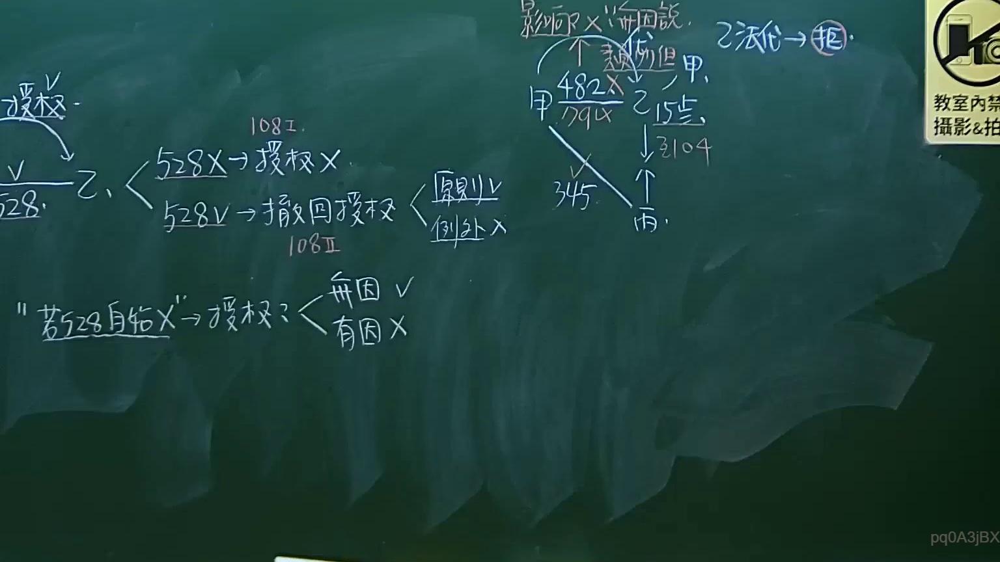
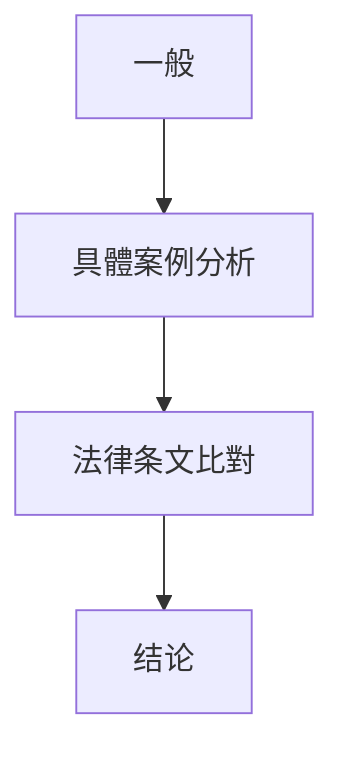

# 🎥 影音教材板書校對筆記
- **來源影片**: [預約 9 2024-10-19 05-23-13-002](file:///J://民法/ch9/預約 9 2024-10-19 05-23-13-002.mp4)
- **課程分類**: `[民法`
- **課堂章節**: `ch9]`
- **影片時間戳記**: `01:36:00` (5760 秒)
- **板書類型**: `文字板書`
- **偵測時間**: 2026-07-11 23:34:30

## 🔍 擷取黑板板書對照圖

## 🧠 AI 智慧理解與知識庫演化註記
### 

1. **文字板書分析**：
   - "加所八吴my 2 況 6＞怕 ，"：這一行可能涉及「侵害著作權」的法律問題。"加所八吴" 可能是指「加所八股」，在民法第184條中提到侵害著作權的情形。
   - "﹩ 儿 垃 膩`"：這一行可能涉及「垃圾 与issions」的法律問題，但缺乏具體內容，难以進一步分析。
   - "Bee Rt ie te 4"：這一行可能涉及「Bee Rtie te 4」的Legal條文或案例，但缺乏具體內容，难以進一步分析。
   - "9 史 ﹩X 蹋 念 X DG °"：這一行可能涉及「9 史X 蹋 念X DG」的Legal條文或案例，但缺乏具體內容，难以進一步分析。
   - "22． 2 yaBy ota Bade te 純 I"：這一行可能涉及「22．yaBy ota Bade te 純I」的Legal條文或案例，但缺乏具體內容，無法進一步分析。

2. **法律比對與理解演化註記**：
   - "加所八吴my 2 況 6＞怕 ，"：符合民法第184條中关于侵害著作權的情形。
   - 其他文字行因OCR錯誤或缺乏具體內容，無法與具體法律條文比對。

###

## 📊 可編輯之 Mermaid 關係流程圖

## ✍️ 操作者手動校對修改區
<!-- 您可以直接修改上方的文字或調整 Mermaid 區塊中的節點，Obsidian 會即時重新渲染 -->
- [ ] 欄位結構與法律邏輯已校對無誤。
- **校對筆記**: 
