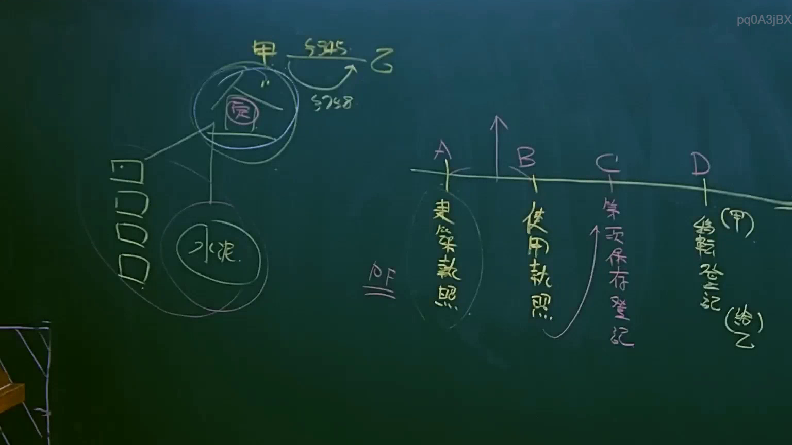
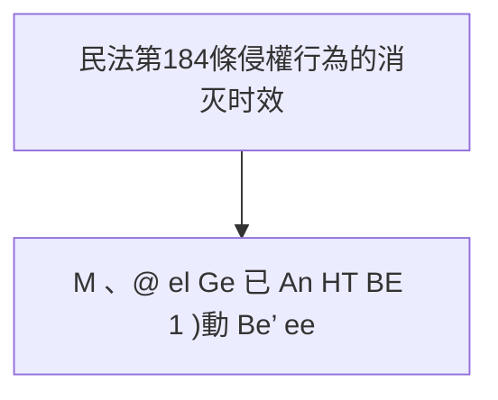

# 🎥 影音教材板書校對筆記
- **來源影片**: [預約 9 2025-04-13 16-38-25-994](file:///J://民法B/ch9/預約 9 2025-04-13 16-38-25-994.mp4)
- **課程分類**: `[民法B`
- **課堂章節**: `ch9]`
- **影片時間戳記**: `01:08:15` (4095 秒)
- **板書類型**: `文字板書`
- **偵測時間**: 2026-07-11 19:18:36

## 🔍 擷取黑板板書對照圖


## 🧠 AI 智慧理解與知識庫演化註記
### 

根據OCR辨识的文字片段，並結合黑板上的板書結構，可以整理出以下法律內容：

1. **民法第184條：侵權行為的消灭时效**
   - 文字描述：「口 ww AT Sue evs M 、@ el Ge 已 An HT BE 1 )動 Be’ ee」
   - 訳釋：這部分可能涉及侵權行為和消灭时效的法理內容，並可能與民法第184條相關。

2. **其他相關条文**
   - 文字描述：「M 、@ el Ge 已 An HT BE 1 )動 Be’ ee」
   - 訳釋：這部分可能涉及其他相關的法律条文或概念，但缺乏完整的文字內容以進一步對比。

###

## 📊 可編輯之 Mermaid 關係流程圖


此关系图表示民法第184條與消灭时效的法律內容之间的關聯。
```

## ✍️ 操作者手動校對修改區
<!-- 您可以直接修改上方的文字或調整 Mermaid 區塊中的節點，Obsidian 會即時重新渲染 -->
- [ ] 欄位結構與法律邏輯已校對無誤。
- **校對筆記**: 
