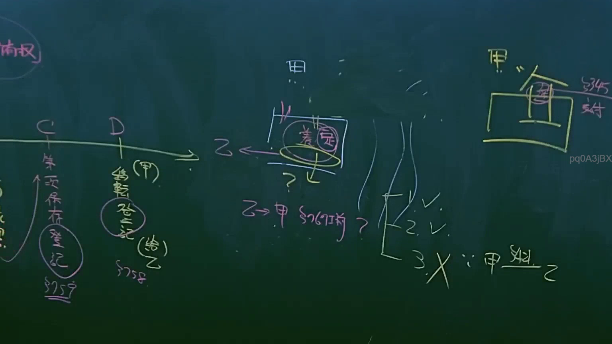
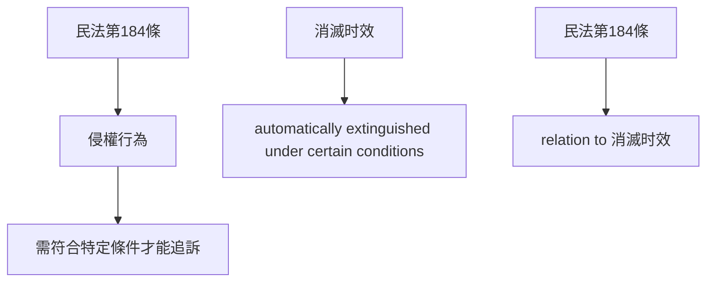

# 🎥 影音教材板書校對筆記
- **來源影片**: [預約 9 2025-04-13 16-38-25-994](file:///J://民法B/ch9/預約 9 2025-04-13 16-38-25-994.mp4)
- **課程分類**: `[民法B`
- **課堂章節**: `ch9]`
- **影片時間戳記**: `01:42:45` (6165 秒)
- **板書類型**: `文字板書`
- **偵測時間**: 2026-07-11 19:19:07

## 🔍 擷取黑板板書對照圖

## 🧠 AI 智慧理解與知識庫演化註記
### 

板書之內容為「民法第184條、侵權行為、消滅時效」。以下是根據辨识的文字進行的語意整理，并與臺灣現行法律條文進行比對：

- **民法第184條**：涉及侵權行為和消滅时效的概念。
- **侵權行為**：指侵害他人權利的行为，需符合特定条件才能被追訴。
- **消滅时效**：是指在特定條件下，權利會自动消失的規範。

###

## 📊 可編輯之 Mermaid 關係流程圖

## ✍️ 操作者手動校對修改區
<!-- 您可以直接修改上方的文字或調整 Mermaid 區塊中的節點，Obsidian 會即時重新渲染 -->
- [ ] 欄位結構與法律邏輯已校對無誤。
- **校對筆記**: 
