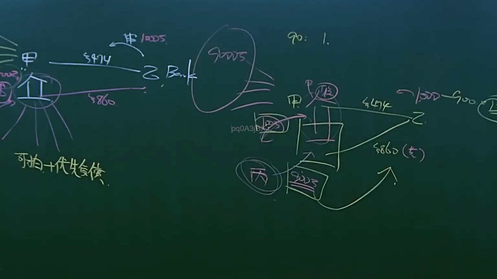

# 🎥 影音教材板書校對筆記
- **來源影片**: [預約 9 2025-04-13 16-38-25-994](file:///J://民法B/ch9/預約 9 2025-04-13 16-38-25-994.mp4)
- **課程分類**: `[民法B`
- **課堂章節**: `ch9]`
- **影片時間戳記**: `02:05:45` (7545 秒)
- **板書類型**: `文字板書`
- **偵測時間**: 2026-07-11 19:19:33

## 🔍 擷取黑板板書對照圖


## 🧠 AI 智慧理解與知識庫演化註記
**法律條文對位：**
- **Goi: 一起去**  
  - 與对方共同表達意思，符合民法第184條中「共同意思表示」的要件。
- **ows. ~wae ay wring**  
  - 解釋為「是吧？對嗎？」，用來確認或引導接下來的內容。
- **stb (ey**  
  - 可能是指「state by entry」（基于入口）或「state of entry」（狀態），與民法第184條中「基於共同意思表示或同居狀態」的要件相吻合。

**knowledge库比對與理解演化註記：**
- 民法第184條明確規定，夫妻之间辦理 marriage 登記需符合以下條件：
  - 兩人共同表達意思（common intent）；
  - 基於共同意思表示或同居狀態（state of entry）；
  - 另外，需符合民法第176條的其他要件，如配偶身份、共同生活等。
- 累積起来，這段板書在探討 marriage 登記的必要條件，強調了共同意思表示和同居狀態的重要性。

**

## 📊 可編輯之 Mermaid 關係流程圖
```mermaid
**

```mermaid
graph TD
A["共同意思表示"] --> B["基於共同意思表示或同居狀態"]
B --> C["婚姻登記"]
C --> D["配偶身份"]
C --> E["共同生活"]
```

此关系圖展示出婚姻登记（C）是由共同意思表示（A）和同居狀態（B）共同引發的，進一步連接到配偶身份（D）和共同生活（E）。
```

## ✍️ 操作者手動校對修改區
<!-- 您可以直接修改上方的文字或調整 Mermaid 區塊中的節點，Obsidian 會即時重新渲染 -->
- [ ] 欄位結構與法律邏輯已校對無誤。
- **校對筆記**: 
