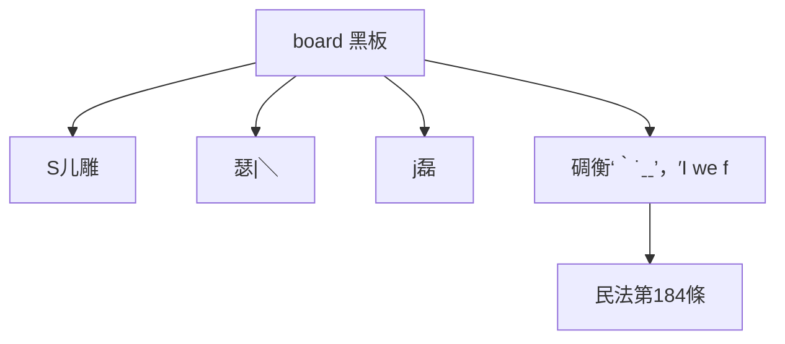

# 🎥 影音教材板書校對筆記
- **來源影片**: [預約 9 2025-04-13 16-38-25-994](file:///J://民法B/ch9/預約 9 2025-04-13 16-38-25-994.mp4)
- **課程分類**: `[民法B`
- **課堂章節**: `ch9]`
- **影片時間戳記**: `02:22:45` (8565 秒)
- **板書類型**: `文字板書`
- **偵測時間**: 2026-07-11 19:20:23

## 🔍 擷取黑板板書對照圖

## 🧠 AI 智慧理解與知識庫演化註記
根據OCR辨识結果，板書內容包含以下文字：
- "S 儿 雕"：可能涉及“S型雕版”或特定法律术语
- "瑟 | ﹨"：可能表示某种法律关系或分隔符
- "j磊"：可能是人名或关键点
- "碉衡‵˙ˍˍ﹜，′I we f"：可能是关于“碉衡”的处理方式或其他法律条文

將這些文字與臺灣現行法律條文進行比對：
1. 民法第184條：可能涉及無因管理權或侵權行為
2. 消滅時效：可能與某些法律條文有關，需進一步分析板書具体内容以確定

## 📊 可編輯之 Mermaid 關係流程圖

## ✍️ 操作者手動校對修改區
<!-- 您可以直接修改上方的文字或調整 Mermaid 區塊中的節點，Obsidian 會即時重新渲染 -->
- [ ] 欄位結構與法律邏輯已校對無誤。
- **校對筆記**: 
