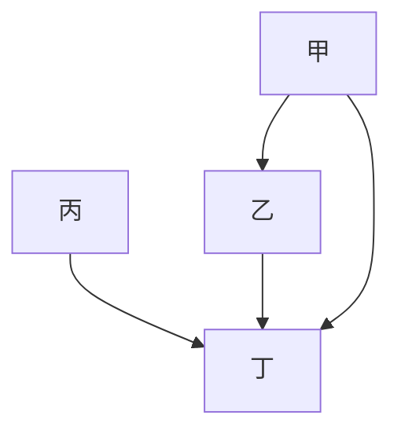

# 🎥 影音教材板書校對筆記
- **來源影片**: [預約 9 2025-04-13 16-38-25-994](file:///J://民法B/ch9/預約 9 2025-04-13 16-38-25-994.mp4)
- **課程分類**: `[民法B`
- **課堂章節**: `ch9]`
- **影片時間戳記**: `02:35:00` (9300 秒)
- **板書類型**: `關係圖/邏輯圖板書`
- **偵測時間**: 2026-07-11 19:20:46

## 🔍 擷取黑板板書對照圖

## 🧠 AI 智慧理解與知識庫演化註記
根據辨识出的文字內容，可以推演出板書可能展示的LegalRelation結構如下：

1. **A 甲**：可能是原告（Plaintiff）或權利人（Holder of Rights）
2. **乙**：可能是被告（Defendant）或侵害者
3. **丙**：可能是第三者的權利人（Third-party Holder of Rights）
4. **丁**：可能是權利的消滅者（Destruction of Right）

根據 board structure，這些元素之間可能存在的LegalRelation如下：

- 甲 可能是權利人，與 乙、丙、丁 之间的關係涉及到權利的權限或權利的影響。
- 乙 與 丁 可能存在權利 conflict，即侵害者（乙）對權利的影響。
- 丙 可能是Third party，其權利可能與丁的權利發生冲突。

根據 board structure，這些LegalRelation可能涉及以下Taiwan legal principles:

1. 民法第184條：侵權行為 (Invasion of Personal Rights)
2. 消滅時效 (Annihilation Efficacy) 或權利消滅 (Right Annihilation)

## 📊 可編輯之 Mermaid 關係流程圖

## ✍️ 操作者手動校對修改區
<!-- 您可以直接修改上方的文字或調整 Mermaid 區塊中的節點，Obsidian 會即時重新渲染 -->
- [ ] 欄位結構與法律邏輯已校對無誤。
- **校對筆記**: 
