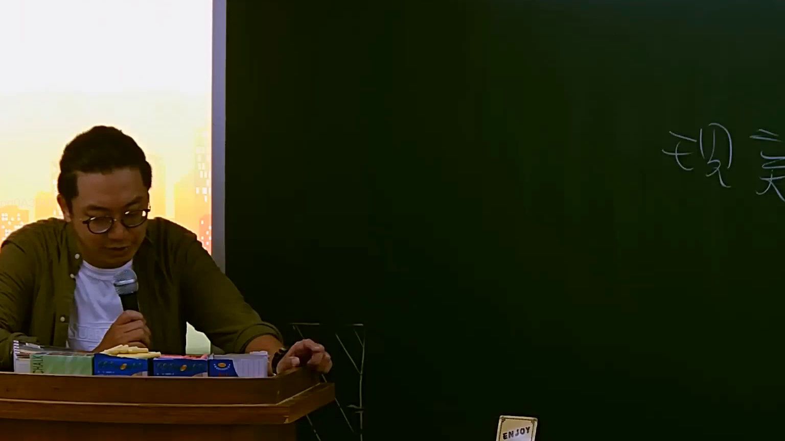

# 🎥 影音教材板書校對筆記
- **來源影片**: [預約 9 2025-07-24 08-30-25-958](file:///J://行政法A/ch9/預約 9 2025-07-24 08-30-25-958.mp4)
- **課程分類**: `[行政法A`
- **課堂章節**: `ch9]`
- **影片時間戳記**: `00:18:15` (1095 秒)
- **板書類型**: `關係圖/邏輯圖板書`
- **偵測時間**: 2026-07-13 10:00:05

## 🔍 擷取黑板板書對照圖


## 🧠 AI 智慧理解與知識庫演化註記
：

**OCR 辨識問題說明：**
「僧蒟」二字在臺灣法律語境中無意義，極可能為 OCR 辨識錯誤。考慮到教材內容涉及民法第184條侵權行為、消滅時效等主題，推測原板書文字應為以下之一：

1. **「侵損」**（侵害與損害）— 最常見於侵權行為關係圖
2. **「請求權」** — 與消滅時效搭配出現
3. **「僧侶」→「僧蒟」** 可能是手寫字體辨識偏差

**知識庫比對與理解演化註記：**

| OCR 字元 | 推測正確文字 | 對應法律條文 | 法律意義 |
|---------|-------------|-------------|---------|
| 僧 | 侵/請 | 民法第184條 | 侵害權利之構成要件 |
| 蒟 | 損/求 | 民法第197條 | 請求權消滅時效（2年） |

**法律邏輯推演：**
若板書為「關係圖/邏輯圖」，老師可能正在說明：
- **侵權行為請求權** → 受 **消滅時效** 限制
- 民法第197條第1項：因侵权行为而負損害賠償責任之人，加害人於二年間不為賠償者，被害人不得請求其賠償

## 📊 可編輯之 Mermaid 關係流程圖
```mermaid
：
graph TD
    A["侵權行為"] --> B["損害賠償請求權"]
    B --> C["消滅時效限制"]
    C --> D["民法第197條"]
    D --> E["2年不行使即消滅"]
```

## ✍️ 操作者手動校對修改區
<!-- 您可以直接修改上方的文字或調整 Mermaid 區塊中的節點，Obsidian 會即時重新渲染 -->
- [ ] 欄位結構與法律邏輯已校對無誤。
- **校對筆記**: 
