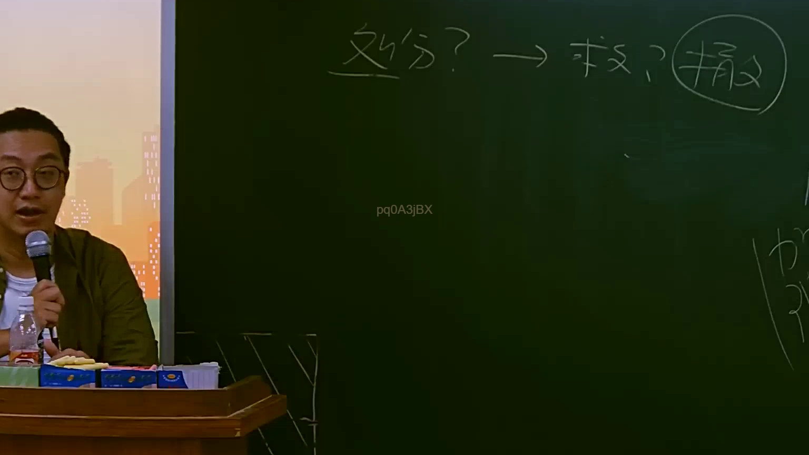
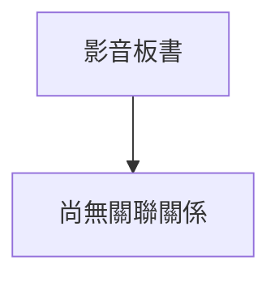

# 🎥 影音教材板書校對筆記
- **來源影片**: [預約 9 2025-07-24 08-30-25-958](file:///J://行政法A/ch9/預約 9 2025-07-24 08-30-25-958.mp4)
- **課程分類**: `[行政法A`
- **課堂章節**: `ch9]`
- **影片時間戳記**: `00:50:00` (3000 秒)
- **板書類型**: `關係圖/邏輯圖板書`
- **偵測時間**: 2026-07-13 10:00:41

## 🔍 擷取黑板板書對照圖

## 🧠 AI 智慧理解與知識庫演化註記
：

您好，您提供的訊息中「擷取區域的 OCR 辨識字元」部分為空白（未顯示任何文字）。我無法在沒有實際板書文字的基礎上進行語意整理、法律條文比對或生成 Mermaid 流程圖。

請您補充以下任一方式之一，我再為您完成分析：

1. **直接貼上 OCR 辨識出的文字**（例如：「甲與乙簽訂預約契約...」等）
2. **描述板書上的關鍵內容**（例如：老師畫了什麼關係圖、寫了哪些字句）
3. **重新提供截圖或文字資料**

一旦收到實際內容，我將立即為您完成：
- 語意整理與法律條文比對註記（民法第184條侵權行為、消滅時效等相關規定）
- Mermaid.js 流程圖代碼生成（含雙引號包裹節點文字）

期待您的補充資料！

## 📊 可編輯之 Mermaid 關係流程圖

## ✍️ 操作者手動校對修改區
<!-- 您可以直接修改上方的文字或調整 Mermaid 區塊中的節點，Obsidian 會即時重新渲染 -->
- [ ] 欄位結構與法律邏輯已校對無誤。
- **校對筆記**: 
