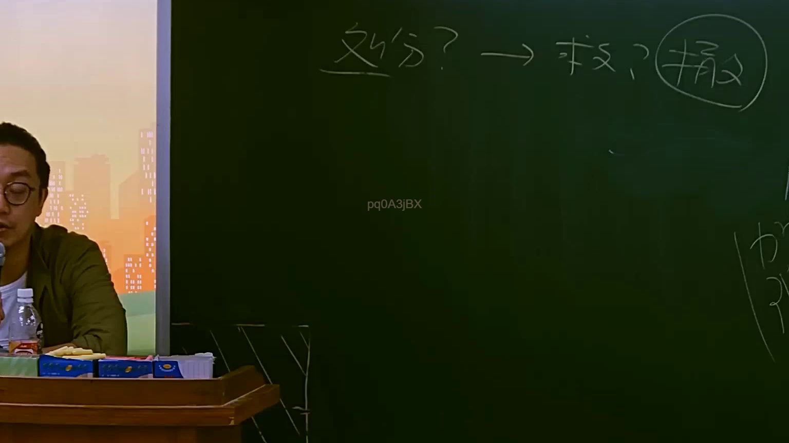
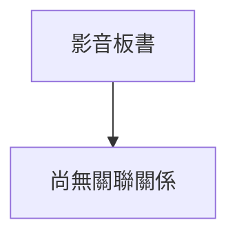

# 🎥 影音教材板書校對筆記
- **來源影片**: [預約 9 2025-07-24 08-30-25-958](file:///J://行政法A/ch9/預約 9 2025-07-24 08-30-25-958.mp4)
- **課程分類**: `[行政法A`
- **課堂章節**: `ch9]`
- **影片時間戳記**: `00:51:30` (3090 秒)
- **板書類型**: `關係圖/邏輯圖板書`
- **偵測時間**: 2026-07-13 10:01:04

## 🔍 擷取黑板板書對照圖

## 🧠 AI 智慧理解與知識庫演化註記
您好，我注意到您提供的訊息中，OCR 辨識字元部分為空白——「擷取區域的 OCR 辨識字元如下：」之後沒有實際文字內容。

由於缺少板書上的具體文字，我無法進行語意整理、條文比對或生成 Mermaid 代碼。

請您補充以下任一方式之一：
1. **貼上 OCR 辨識出的文字**（即使有錯別字也沒關係）
2. **描述黑板上的圖畫結構**（例如：有哪些方塊/箭頭/關鍵字，它們之間的邏輯關係為何）

一旦收到內容，我將立即為您完成：
- 📖 語意整理與民法條文比對（如第184條侵權行為、消滅時效等）
- 🔗 Mermaid.js 流程圖代碼生成

請補充資訊，謝謝！

## 📊 可編輯之 Mermaid 關係流程圖

## ✍️ 操作者手動校對修改區
<!-- 您可以直接修改上方的文字或調整 Mermaid 區塊中的節點，Obsidian 會即時重新渲染 -->
- [ ] 欄位結構與法律邏輯已校對無誤。
- **校對筆記**: 
