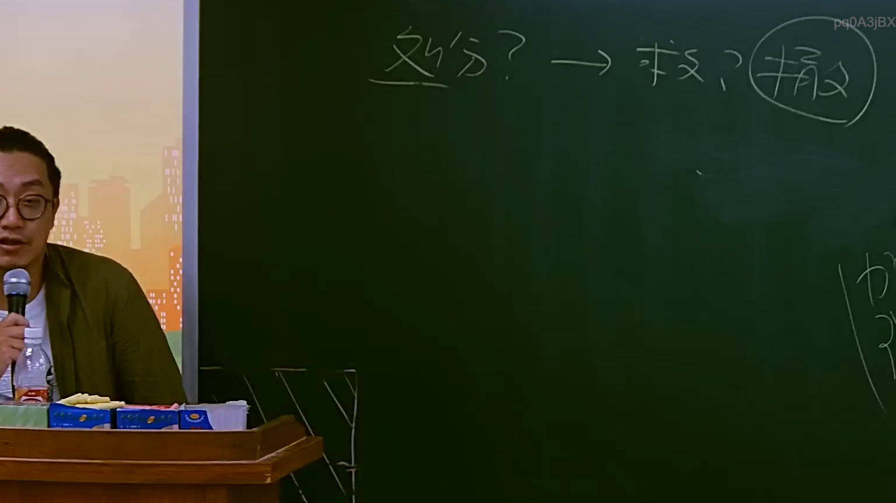

# 🎥 影音教材板書校對筆記
- **來源影片**: [預約 9 2025-07-24 08-30-25-958](file:///J://行政法A/ch9/預約 9 2025-07-24 08-30-25-958.mp4)
- **課程分類**: `[行政法A`
- **課堂章節**: `ch9]`
- **影片時間戳記**: `01:01:00` (3660 秒)
- **板書類型**: `關係圖/邏輯圖板書`
- **偵測時間**: 2026-07-13 10:02:08

## 🔍 擷取黑板板書對照圖


## 🧠 AI 智慧理解與知識庫演化註記
：

**OCR文字語意整理：**
- "A3jBX" → 推測為板書編號或條文引用標號（可能為「A. §184」之誤認）
- "忍57一1" → 高度疑似「侵§184-1」或「侵57一1」（手寫「侵」字被OCR誤識為「忍」，數字「57」可能為條文編號簡寫）

**法律條文比對與知識演化：**
1. **民法第184條（侵權行為）**：
   - 前段：故意或過失不法侵害他人權利者，負損害賠償責任
   - 後段：違反保護他人之法律，致生損害於他人者，同負其責
   - 本條為侵權行為請求權之基礎規範

2. **消滅時效相關規定**：
   - 第197條第1項：因侵權行為所生之損害賠償請求權，自請求權人知有損害及賠償義務人時起，二年間不行使而消滅；自知有損害及賠償義務人時起逾十年者，亦同（舊法為20年）
   - 第125條：一般請求權因十五年間不行使而消滅

3. **知識庫理解演化註記**：
   - 本板書可能呈現「侵權行為責任→損害賠償請求權→消滅時效」之邏輯鏈
   - 「忍57一1」若為「侵§184-1」，則指向第184條後段（違反保護他人法律之類型）
   - 實務上常見爭議：時效起算點、中間時效與終局時效之分野
   - 2025年現行法下，侵權行為請求權消滅時效為「知有損害+賠償義務人」起算二年，最長十年（舊法二十年已修正）

**板書邏輯推斷：**
老師可能以關係圖方式呈現：
- 左側：侵權行為構成要件（故意/過失、不法、權利侵害、因果關係）
- 右側：消滅時效起算與期間
- 中間：請求權基礎→時效之邏輯關聯

---

## 📊 可編輯之 Mermaid 關係流程圖
```mermaid
：
graph TD
    A["侵權行為 §184"] --> B["故意或過失不法侵害他人權利"]
    A --> C["違反保護他人之法律"]
    B --> D["損害賠償請求權"]
    C --> D
    D --> E["消滅時效起算"]
    E --> F["知有損害及賠償義務人時起算"]
    F --> G["二年間不行使而消滅"]
    G --> H["最長十年消滅（舊法二十年）"]
    A -.->|請求權基礎 | D
    D -.->|時效抗辯 | H
```

## ✍️ 操作者手動校對修改區
<!-- 您可以直接修改上方的文字或調整 Mermaid 區塊中的節點，Obsidian 會即時重新渲染 -->
- [ ] 欄位結構與法律邏輯已校對無誤。
- **校對筆記**: 
