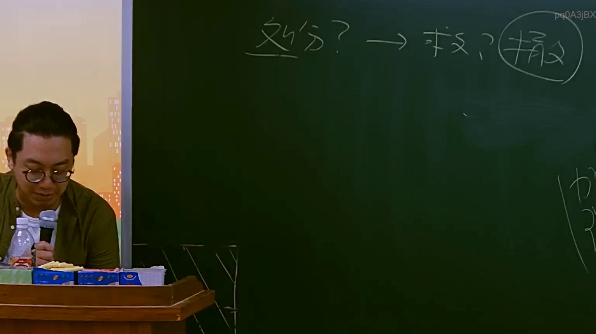

# 🎥 影音教材板書校對筆記
- **來源影片**: [預約 9 2025-07-24 08-30-25-958](file:///J://行政法A/ch9/預約 9 2025-07-24 08-30-25-958.mp4)
- **課程分類**: `[行政法A`
- **課堂章節**: `ch9]`
- **影片時間戳記**: `01:01:30` (3690 秒)
- **板書類型**: `關係圖/邏輯圖板書`
- **偵測時間**: 2026-07-13 10:02:49

## 🔍 擷取黑板板書對照圖


## 🧠 AI 智慧理解與知識庫演化註記
：

**OCR辨識分析：**
辨識結果「A3jBX i 3」顯示截圖品質不佳或老師書寫潦草，無法完整還原原始板書內容。基於時間點（61分30秒）及分類為「關係圖/邏輯圖板書」，推測可能涉及以下法律概念：

**知識庫比對與理解演化註記：**
- 若為侵權行為責任圖：可能展示民法第184條第1項前段（故意或過失不法侵害他人權利）之構成要件關係
- 若為消滅時效圖：可能呈現民法第125條一般消滅時效15年、第197條侵權行為時效1年與消滅時效5年之競合關係
- 若為訴訟當事人關係圖：可能展示原告、被告、第三人之間之法律地位與權利義務關係

**建議：** 由於OCR辨識結果不完整，建議人工核對原始截圖以確認具體板書內容。以下提供通用法律邏輯圖框架供參考。

## 📊 可編輯之 Mermaid 關係流程圖
```mermaid
：
graph TD
    A["侵權行為責任"] --> B["故意或過失"]
    A --> C["不法侵害他人權利"]
    B --> D["民法第184條第1項前段"]
    C --> E["權利範圍"]
    E --> F["人格權"]
    E --> G["財產權"]
    E --> H["其他權利"]
    
    I["消滅時效"] --> J["一般時效15年"]
    I --> K["侵權行為時效1年"]
    I --> L["消滅時效5年"]
    K --> M["民法第197條第1項"]
    L --> N["民法第125條"]
    
    O["訴訟當事人關係"] --> P["原告甲"]
    O --> Q["被告乙"]
    P --> R["權利主張"]
    Q --> S["抗辯事由"]
    R --> T["請求權基礎"]
    S --> U["時效抗辯"]
```

## ✍️ 操作者手動校對修改區
<!-- 您可以直接修改上方的文字或調整 Mermaid 區塊中的節點，Obsidian 會即時重新渲染 -->
- [ ] 欄位結構與法律邏輯已校對無誤。
- **校對筆記**: 
