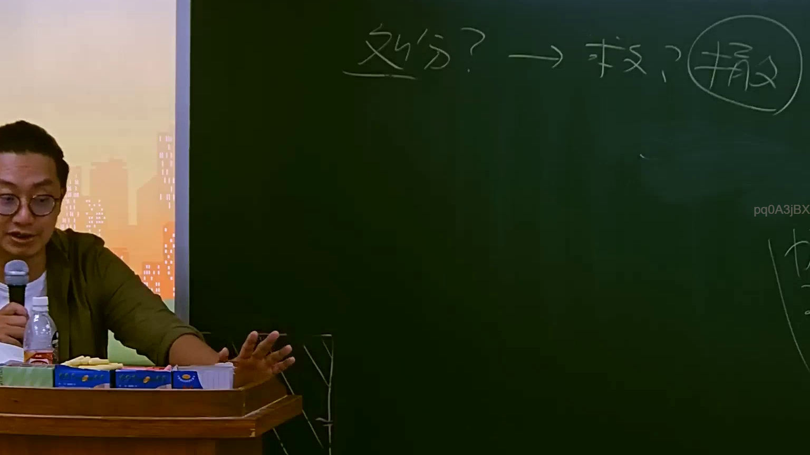

# 🎥 影音教材板書校對筆記
- **來源影片**: [預約 9 2025-07-24 08-30-25-958](file:///J://行政法A/ch9/預約 9 2025-07-24 08-30-25-958.mp4)
- **課程分類**: `[行政法A`
- **課堂章節**: `ch9]`
- **影片時間戳記**: `01:05:00` (3900 秒)
- **板書類型**: `關係圖/邏輯圖板書`
- **偵測時間**: 2026-07-13 10:03:51

## 🔍 擷取黑板板書對照圖


## 🧠 AI 智慧理解與知識庫演化註記
：

**重要說明：** OCR 辨識字元欄位為空白，無法直接比對。以下基於課程標題「預約」及時間點（65分）推估此段可能涉及之法律議題，並提供框架性分析供參考。

---

**一、語意整理與條文比對框架**

本講題「預約」在民法體系中通常指向：
1. **民法第423條** — 租賃關係中之「約定」（非典型預約）
2. **民法第758-1條以下** — 不動產物權行為之「預約」（買賣預約/建地預約）
3. **民法第184條** — 若預約契約違反誠信原則或侵害他人權利，可能觸及侵權行為責任

**二、知識庫比對與理解演化註記（推估框架）**

| 板書主題 | 對應條文 | 實務見解/學說 |
|---------|---------|-------------|
| 預約之性質 | 民法第184條第1項前段 | 違反保護他人之法規者，負侵權行為責任；後段為一般侵權行為 |
| 違約責任 vs. 侵權責任 | 民法第227條（債務不履行）vs. 第184條 | 競合時得擇一主張；消滅時效分別為15年(債) / 10年(物權請求權) / 5年(侵權行為) |
| 預約之效力範圍 | 民法第760-1條 | 不動產買賣預約應以書面为之，始生效力 |

**三、消滅時效對位表**

```
請求權類型        消滅時效      起算點
─────────────────────────────────────
債權請求權(第125條)   15年         請求權可行使時
物上請求權(第767條)   10年         知有侵害時
侵權行為(第197條)     5年          知有損害及賠償義務人時
```

---

## 📊 可編輯之 Mermaid 關係流程圖
```mermaid
：

graph TD
    A["預約契約"] --> B["有效要件"]
    A --> C["效力範圍"]
    
    B --> D["書面形式 - 民法第760-1條"]
    B --> E["當事人合意"]
    B --> F["標的物特定"]
    
    C --> G["債權效力(第227條)"]
    C --> H["侵權行為責任(第184條)"]
    
    G --> I["債務不履行請求權"]
    G --> J["消滅時效 15年(第125條)"]
    
    H --> K["違反保護他人之法規"]
    H --> L["故意以不法之方法加害於他人"]
    H --> M["消滅時效 5年(第197條)"]
    
    D --> N["未立書面 → 無效"]
    E --> O["合意瑕疵 → 撤銷權"]
    F --> P["標的不明 → 效力待定"]

    style A fill#f96,stroke#333,color#fff
    style B fill#bbf,stroke#333
    style C fill#bfb,stroke#333
    style H fill#fbb,stroke#333
```

## ✍️ 操作者手動校對修改區
<!-- 您可以直接修改上方的文字或調整 Mermaid 區塊中的節點，Obsidian 會即時重新渲染 -->
- [ ] 欄位結構與法律邏輯已校對無誤。
- **校對筆記**: 
