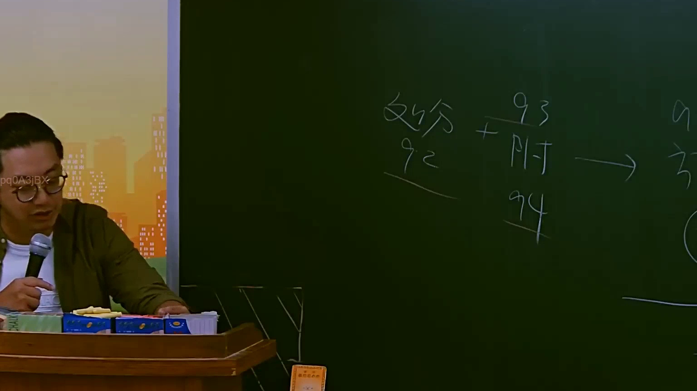
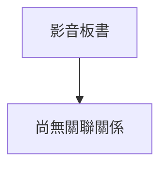

# 🎥 影音教材板書校對筆記
- **來源影片**: [預約 9 2025-07-24 08-30-25-958](file:///J://行政法A/ch9/預約 9 2025-07-24 08-30-25-958.mp4)
- **課程分類**: `[行政法A`
- **課堂章節**: `ch9]`
- **影片時間戳記**: `01:53:30` (6810 秒)
- **板書類型**: `關係圖/邏輯圖板書`
- **偵測時間**: 2026-07-13 10:04:22

## 🔍 擷取黑板板書對照圖

## 🧠 AI 智慧理解與知識庫演化註記
：
您提供的訊息中，OCR 辨識字元區域為空白（「如下：」之後沒有實際文字內容）。因此我無法進行以下工作：

1. **語意整理** — 無辨識文字可供分析。
2. **條文比對** — 無法與民法第184條、侵權行為、消滅時效等條文進行對位。
3. **Mermaid 圖表生成** — 無板書結構可轉化為流程圖或邏輯樹。

---

請您補充 OCR 辨識出的實際文字內容，我將立即為您完成：

- 📝 語意整理與法律條文比對註記
- 🔗 Mermaid.js 關係圖 / 邏輯圖代碼生成（依板書類型自動判斷格式）

期待您的回覆！

## 📊 可編輯之 Mermaid 關係流程圖

## ✍️ 操作者手動校對修改區
<!-- 您可以直接修改上方的文字或調整 Mermaid 區塊中的節點，Obsidian 會即時重新渲染 -->
- [ ] 欄位結構與法律邏輯已校對無誤。
- **校對筆記**: 
