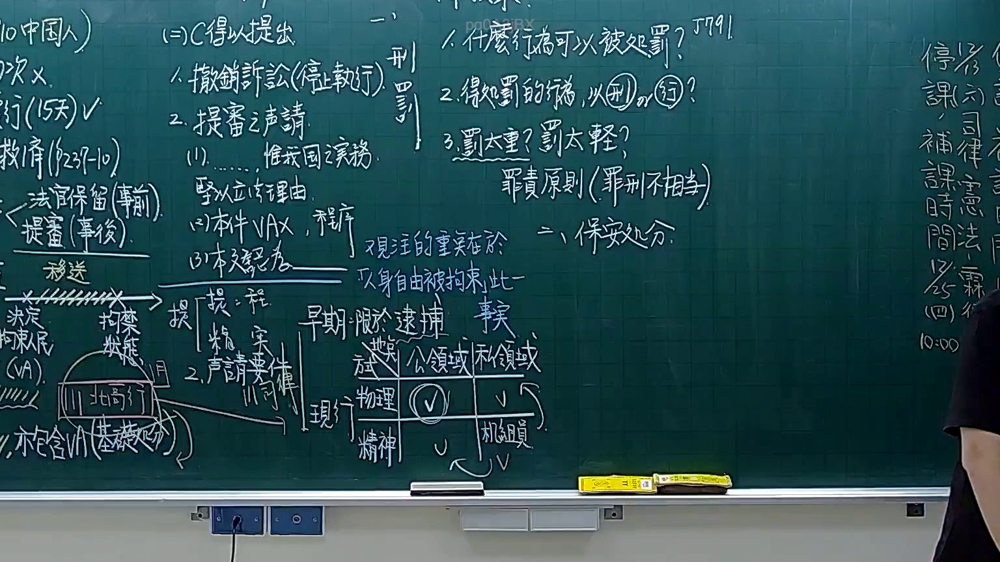

# 🎥 影音教材板書校對筆記
- **來源影片**: [預約 9 2025-12-12 05-06-34-040](file:///H:/憲法霖洄/ch9/預約 9 2025-12-12 05-06-34-040.mp4)
- **課程分類**: `預設課程`
- **課堂章節**: `ch9`
- **影片時間戳記**: `01:03:15` (3795 秒)
- **板書類型**: `文字板書`
- **偵測時間**: 2026-07-13 20:33:22

## 🔍 擷取黑板板書對照圖


## 🧠 AI 智慧理解與知識庫演化註記
1. **板書之內容分析**：
   - 文字板書主要包含以下內容：
     - 民法第184條：侵權行為特别损害賠償相关内容。
     - 消滅時效問題：可能涉及身份或職業相关的法律条文。
     - 具体案例或條款引用，如「AUST」、「《 [Sa 洪」等。

2. **與現行法律條文的比對**：
   - **民法第184條**：涉及侵權行為特别损害賠償，可能在板書中提到。
   - **消滅時效問題**：可能涉及身份或職業相关的條款，需進一步查閱相關法規。

3. **法律理解演化註記**：
   - 民法第184條：侵權行為特别损害賠償。
   - 消滅時效：可能與身份或職業相關的條款。
   - 具体案例或條款引用，需進一步分析。

## 📊 可編輯之 Mermaid 關係流程圖
```mermaid
graph TD
    A["民法第184條" {侵權行為特别损害賠償}]
        C["具體內容" {A中提到的內容]}
    B["身份或職業" {可能涉及的條款}]
        D["消滅時效問題"]
```

## ✍️ 操作者手動校對修改區
<!-- 您可以直接修改上方的文字或調整 Mermaid 區塊中的節點，Obsidian 會即時重新渲染 -->
- [ ] 欄位結構與法律邏輯已校對無誤。
- **校對筆記**: 
