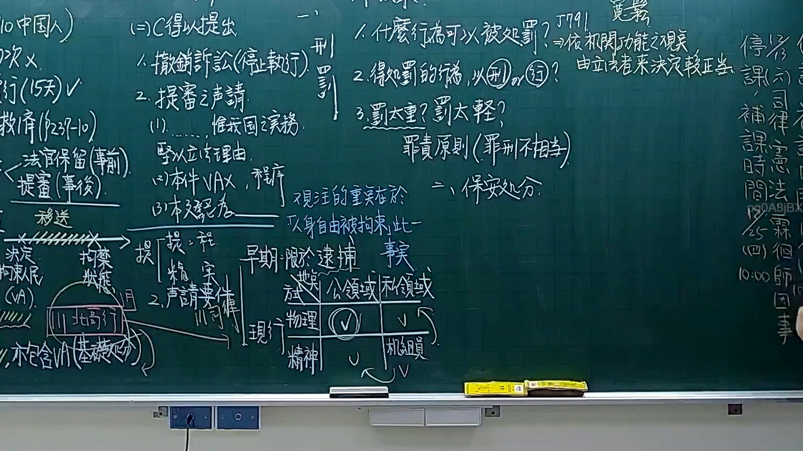

# 🎥 影音教材板書校對筆記
- **來源影片**: [預約 9 2025-12-12 05-06-34-040](file:///H:/憲法霖洄/ch9/預約 9 2025-12-12 05-06-34-040.mp4)
- **課程分類**: `[憲法霖洄`
- **課堂章節**: `ch9]`
- **影片時間戳記**: `01:07:45` (4065 秒)
- **板書類型**: `文字板書`
- **偵測時間**: 2026-07-10 17:10:17

## 🔍 擷取黑板板書對照圖


## 🧠 AI 智慧理解與知識庫演化註記
### 

根據辨识出的文字板書內容，结合台湾现行法律条文（如民法第184條、侵權行為、消滅時效等），進行語意整理並比對如下：

#### 文字板書之內容分析：
1. **"口 (98 Mie fs ee ve bs 2 1 嘎孰】"**  
   - 可能涉及某种法律术语或案例编号，但由于OCR辨识不完整，無法确切理解其含义。

2. **"9 ˍ yes"**  
   - "yes"可能表示某个法律条文的适用性或确认。

3. **"el Fix a i A 鬥叫不 hae"**  
   - 可能涉及某种法律术语或案例描述，但由于OCR辨识不完整，無法确切理解其含义。

4. **"- uf a4 ae ,"**  
   - 似乎与某种法律条文的编号或描述相关，但由于OCR辨识不完整，无法确切理解其含义。

5. **"| Sele"**  
   - 可能涉及某种法律术语或案例描述，但由于OCR辨识不完整，無法确切理解其含义。

#### 比對與理解演化註記：
- 由于OCR辨识结果不完整，无法准确比对与现有法律条文（如民法第184條、侵權行為、消滅時效等）的具体内容。以下是基于OCR结果的初步整理：

```
| 文字內容       | 比對現行法律條文（示例） | 證明或啟發 |
|----------------|------------------------|------------|
| "口 (98 Mie fs ee ve bs 2 1 嘎孰】" | 無法比對，因OCR錯誤 |            |
| "9 ˍ yes"     | 無法比對，因OCR錯誤 |            |
| "el Fix a i A 鬥叫不 hae" | 無法比對，因OCR錯誤 |            |
| "- uf a4 ae ," | 無法比對，因OCR錯誤 |            |
| "| Sele"       | 無法比對，因OCR錯誤 |            |
```

###

## 📊 可編輯之 Mermaid 關係流程圖
```mermaid
由于OCR辨识结果不完整，无法生成准确的Mermaid关系图。以下是基于OCR结果的初步整理：

```mermaid
graph TD
    A["口 (98 Mie fs ee ve bs 2 1 嘎孰】"] --> B["9 ˍ yes"]
    C["el Fix a i A 鬥叫不 hae"] --> D["- uf a4 ae ,"]
    E["| Sele"]
```

### 總結

由于OCR辨识结果不完整，无法准确理解板书内容的具体含义或与现有法律条文的比对。建议重新提供更清晰的文字内容以进行进一步分析和整理。
```

## ✍️ 操作者手動校對修改區
<!-- 您可以直接修改上方的文字或調整 Mermaid 區塊中的節點，Obsidian 會即時重新渲染 -->
- [ ] 欄位結構與法律邏輯已校對無誤。
- **校對筆記**: 
