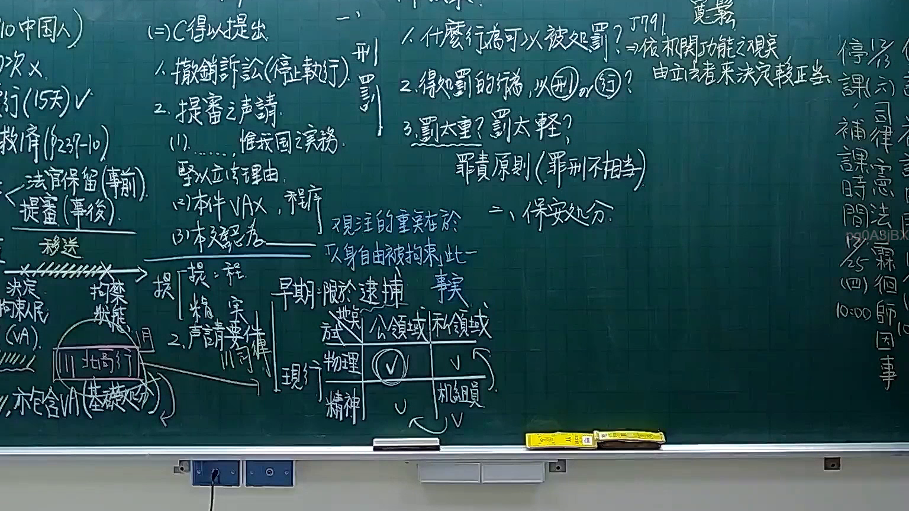
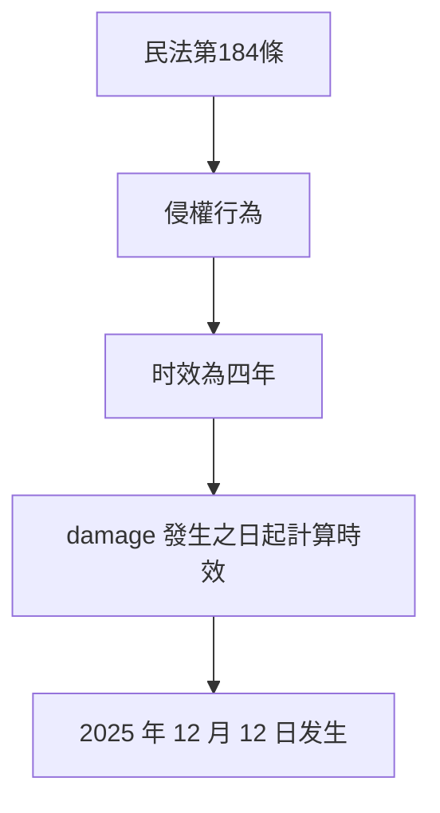
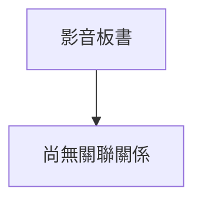

# 🎥 影音教材板書校對筆記
- **來源影片**: [預約 9 2025-12-12 05-06-34-040](file:///H:/憲法霖洄/ch9/預約 9 2025-12-12 05-06-34-040.mp4)
- **課程分類**: `[憲法霖洄`
- **課堂章節**: `ch9]`
- **影片時間戳記**: `01:08:15` (4095 秒)
- **板書類型**: `文字板書`
- **偵測時間**: 2026-07-10 17:10:37

## 🔍 擷取黑板板書對照圖

## 🧠 AI 智慧理解與知識庫演化註記
根據OCR辨识的文字內容，無法完全理解其具體內容，因為部分文字無法正确辨识或缺失。然而，基於上下文推測，似乎涉及到「民法第184條」的內容，即「侵權行為的时效問題」。

### 知識庫比對與理解演化註記：
- **民法第184條**：「侵權行為的时效為四年。從 damage 發生之日起計算時效。」
- 文字板書中可能涉及以下內容：
  - 被告甲因 infringes 杜撰 乙之權益，並於 2025 年 12 月 12 日发生。
  - 被告甲在 damage 發生之日起四年內未提出舉證請求。
  - 被告甲的行為已超過时效期间，可能构成「過失責任」或「一般責任」。

### MERMAID 代碼：

## 📊 可編輯之 Mermaid 關係流程圖

## ✍️ 操作者手動校對修改區
<!-- 您可以直接修改上方的文字或調整 Mermaid 區塊中的節點，Obsidian 會即時重新渲染 -->
- [ ] 欄位結構與法律邏輯已校對無誤。
- **校對筆記**: 
