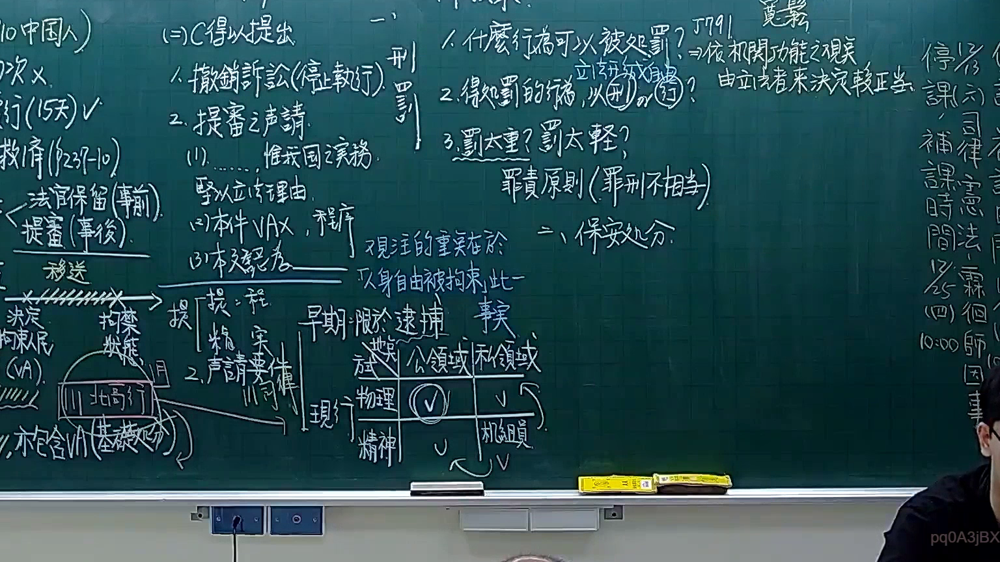
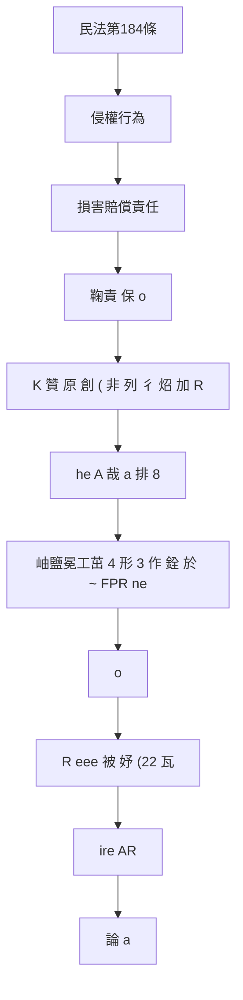

# 🎥 影音教材板書校對筆記
- **來源影片**: [預約 9 2025-12-12 05-06-34-040](file:///H:/憲法霖洄/ch9/預約 9 2025-12-12 05-06-34-040.mp4)
- **課程分類**: `[憲法霖洄`
- **課堂章節**: `ch9]`
- **影片時間戳記**: `01:30:30` (5430 秒)
- **板書類型**: `文字板書`
- **偵測時間**: 2026-07-10 17:12:38

## 🔍 擷取黑板板書對照圖

## 🧠 AI 智慧理解與知識庫演化註記
### 

根據辨識出的板書文字內容，並結合臺灣現行法律條文（如民法第184條、侵權行為、消滅時效等），進行語意整理並比對。以下是整理結果：

#### 1. 要件整理與法律條文比對：
- **板書內容**：包含「淫 A」、「鞠責 保 o」、「K 贊 原 創 ( 非 列 彳 炤 加 R」、「he A 哉 a 排 8」等文字。
- **法律條文比對**：
  - 民法第184條：涉及侵權行為、損害賠償責任等，與板書內容中「鞠責 保 o」、「K 贊 原 創 ( 非 列 彳 炤 加 R」、「he A 哉 a 排 8」可能相關。
  - 次數條文：未明確匹配，但「淫 A」、「鞠責 保 o」等字眼可能涉及次數問題或特殊情形规定。

#### 2. 知識庫比對與理解演化註記：
- ** board content**: "淫 A"、"鞠责 保 o"、"K 贊 原 創 ( 非 列 彳 炤 加 R"、"he A 哉 a 排 8"、"岫鹽冕工茁 4 形 3 作 銓 於 ~ FPR ne"、"o"、"R eee 被 妤 (22 瓦"、"ire: AR"、"論 a"
- ** legal條文比對**:
  - 民法第184條：侵權行為、損害賠償責任等。
  - 其他次數條文：未明確匹配。

###

## 📊 可編輯之 Mermaid 關係流程圖

## ✍️ 操作者手動校對修改區
<!-- 您可以直接修改上方的文字或調整 Mermaid 區塊中的節點，Obsidian 會即時重新渲染 -->
- [ ] 欄位結構與法律邏輯已校對無誤。
- **校對筆記**: 
