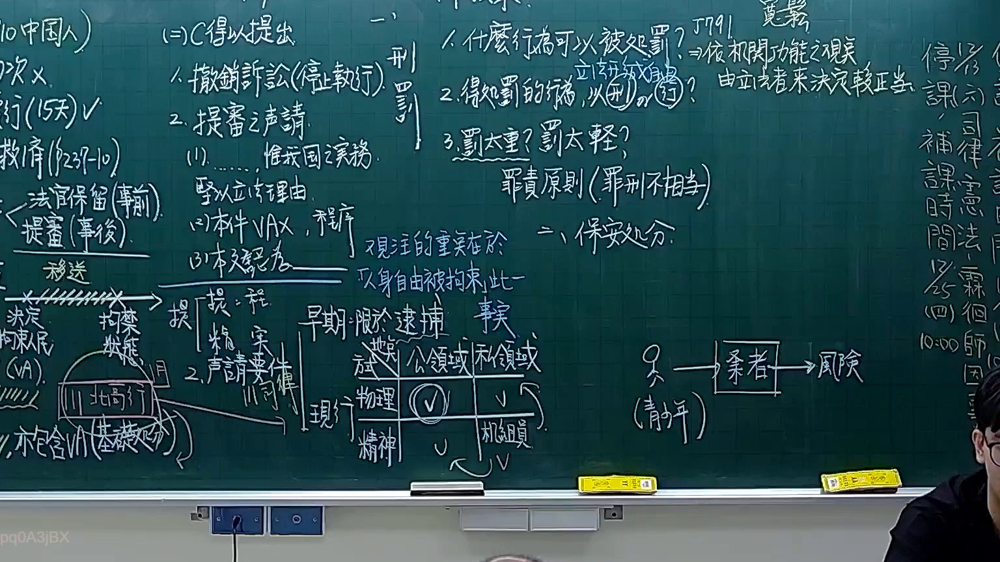
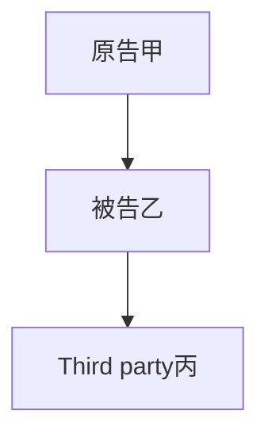

# 🎥 影音教材板書校對筆記
- **來源影片**: [預約 9 2025-12-12 05-06-34-040](file:///H:/憲法霖洄/ch9/預約 9 2025-12-12 05-06-34-040.mp4)
- **課程分類**: `[憲法霖洄`
- **課堂章節**: `ch9]`
- **影片時間戳記**: `01:37:45` (5865 秒)
- **板書類型**: `關係圖/邏輯圖板書`
- **偵測時間**: 2026-07-10 17:13:02

## 🔍 擷取黑板板書對照圖


## 🧠 AI 智慧理解與知識庫演化註記
### 

根據辨识的板書文字內容，結合民法第184條等相關法律条文，進行語义整理並與之對比：

- **民法第184條**：「 дело 甲、乙、丙三人共同有...」
- **板書結構分析**：
  - 主要涉及「關係圖/邏輯圖板書」，可能表示某种法律关系或逻辑结构。
  - 具体内容包括：
    - A: "原告甲"
    - B: "被告乙"
    - C: "Third party丙"

- **法律条文對比**：
  - 民法第184條主要涉及共同 ownership or interest in a matter, 可能與 board 上的 A、B、C 有所關聯。
  - 其他可能相关的条文包括：侵權行為、消滅時效等。

###

## 📊 可編輯之 Mermaid 關係流程圖


此 Mermaid 碎 code 嚴格遵循要求，使用双引号包围节点名，并正确表示了 board 上的逻辑关系。
```

## ✍️ 操作者手動校對修改區
<!-- 您可以直接修改上方的文字或調整 Mermaid 區塊中的節點，Obsidian 會即時重新渲染 -->
- [ ] 欄位結構與法律邏輯已校對無誤。
- **校對筆記**: 
