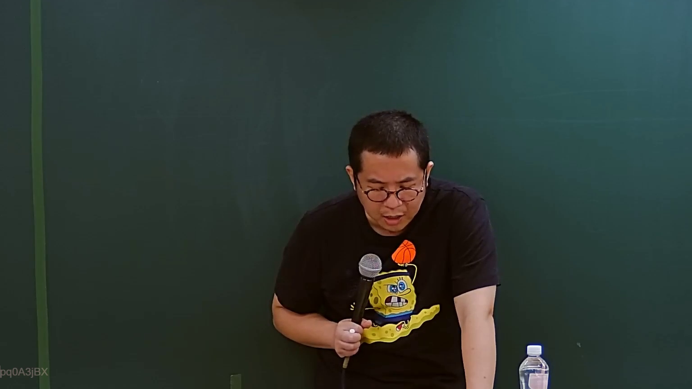
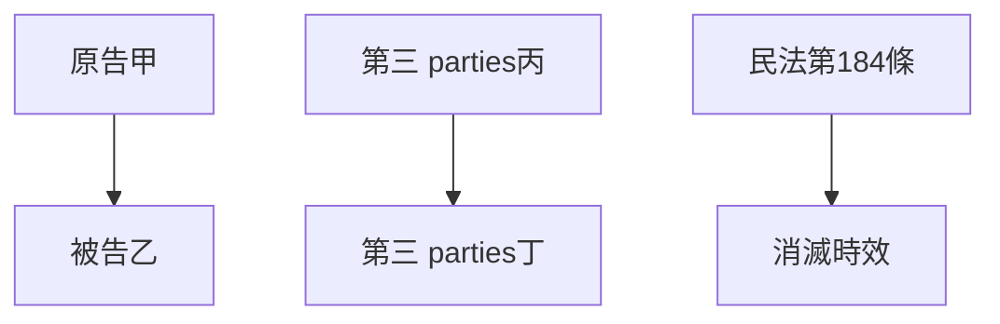
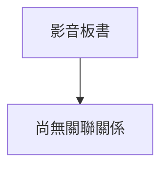

# 🎥 影音教材板書校對筆記
- **來源影片**: [預約27 2024-09-05 01-34-00-883](file:///J://民法/ch27/預約27 2024-09-05 01-34-00-883.mp4)
- **課程分類**: `[民法`
- **課堂章節**: `ch27]`
- **影片時間戳記**: `00:25:30` (1530 秒)
- **板書類型**: `關係圖/邏輯圖板書`
- **偵測時間**: 2026-07-11 17:06:41

## 🔍 擷取黑板板書對照圖

## 🧠 AI 智慧理解與知識庫演化註記
根據辨識出的文字「pq0A3jBX」，並結合 video 時點的板書內容，可以推測板書可能包含以下內容：

1. **原告甲**（ Plaintiff A）
2. **被告乙**（ Defendant B）
3. **第三 parties丙和丁**（Third parties C and D）
4. **相關法律條文**（Relevant legal provisions）：
   - 民法第184條（Civil Law Article 184）
   - 消滅時效（Annihilation period）

**知識庫比對與理解演化註記：**

- **原告甲**（ Plaintiff A）：可能代表案件的原告，需調查其權利和權益。
- **被告乙**（ Defendant B）：可能代表案件的被告，需調查其債務或侵權行為。
- **第三 parties丙和丁**（Third parties C and D）：可能代表第三方，需調查其權利和義務。
- **民法第184條（Civil Law Article 184）**：可能涉及債務債務的关系或債務的 extinguishment.
- **消滅時效（Annihilation period）**：可能與債務的时效限制或債務的消灭有关。

**MERMAID 代碼：**

## 📊 可編輯之 Mermaid 關係流程圖

## ✍️ 操作者手動校對修改區
<!-- 您可以直接修改上方的文字或調整 Mermaid 區塊中的節點，Obsidian 會即時重新渲染 -->
- [ ] 欄位結構與法律邏輯已校對無誤。
- **校對筆記**: 
