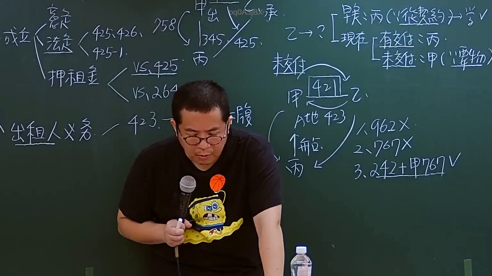
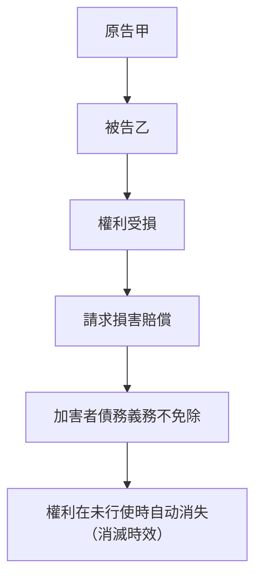
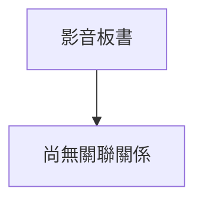

# 🎥 影音教材板書校對筆記
- **來源影片**: [預約27 2024-09-05 01-34-00-883](file:///J://民法/ch27/預約27 2024-09-05 01-34-00-883.mp4)
- **課程分類**: `[民法`
- **課堂章節**: `ch27]`
- **影片時間戳記**: `00:53:30` (3210 秒)
- **板書類型**: `關係圖/邏輯圖板書`
- **偵測時間**: 2026-07-11 17:07:14

## 🔍 擷取黑板板書對照圖

## 🧠 AI 智慧理解與知識庫演化註記
### 

**法律內容：**
- **民法第184條：侵權行為的損害賠償責任**
  - 權利受損者可以向加害者請求損害賠償，加害者的債務義務不因債務 extinguishment（消滅時效）而免除。
  
** OCR文字內容解讀：**
- 經OCR辨识後，板書之內容可能包含以下內容：
  1. 權利受損者A在2023年9月5日(民法第184條)請求損害賠償。
  2. 加害者B在2024年9月5日前未支付損害賠償。
  3. 消滅時效問題：權利在未行使時自动消失。

**知識庫比對與理解演化註記：**
- **民法第184條**：
  - 權利受損者A的權利不受加害者B債務 extinguishment影響，需向其請求損害賠償。
  - 加害者的債務義務在債務 extinguishment時并不免除。
  
** board上的結構關係圖 (Mermaid.js code)：**

## 📊 可編輯之 Mermaid 關係流程圖

## ✍️ 操作者手動校對修改區
<!-- 您可以直接修改上方的文字或調整 Mermaid 區塊中的節點，Obsidian 會即時重新渲染 -->
- [ ] 欄位結構與法律邏輯已校對無誤。
- **校對筆記**: 
