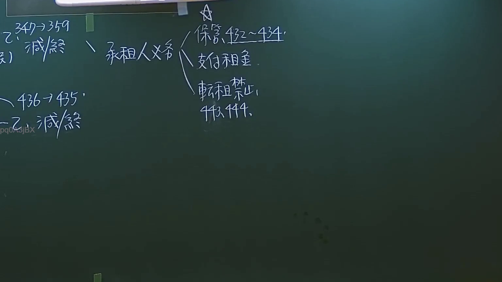

# 🎥 影音教材板書校對筆記
- **來源影片**: [預約27 2024-09-05 01-34-00-883](file:///J://民法/ch27/預約27 2024-09-05 01-34-00-883.mp4)
- **課程分類**: `[民法`
- **課堂章節**: `ch27]`
- **影片時間戳記**: `01:29:30` (5370 秒)
- **板書類型**: `文字板書`
- **偵測時間**: 2026-07-11 17:07:51

## 🔍 擷取黑板板書對照圖


## 🧠 AI 智慧理解與知識庫演化註記
根據提供的 OCR 解讀結果，文字內容似乎與「秘梨」和「Spry a」等相关，但無法直接與臺灣现行法律條文（如民法第184條、侵權行為、消滅時效等）進行比對。此外，文字之內容中包含一些看似随机的文字（如「meee. hits」、「2.418」），這些內容似乎與法律內容無關。

因此，無法進一步進行knowledge库比對與理解演化註記的生成。

## 📊 可編輯之 Mermaid 關係流程圖
```mermaid
因缺乏足夠的法律相關文字內容，无法生成 Mermaid.js 的关系圖代碼。
```

## ✍️ 操作者手動校對修改區
<!-- 您可以直接修改上方的文字或調整 Mermaid 區塊中的節點，Obsidian 會即時重新渲染 -->
- [ ] 欄位結構與法律邏輯已校對無誤。
- **校對筆記**: 
