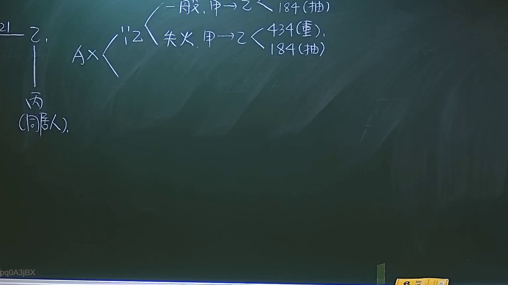

# 🎥 影音教材板書校對筆記
- **來源影片**: [預約27 2024-09-05 01-34-00-883](file:///J://民法/ch27/預約27 2024-09-05 01-34-00-883.mp4)
- **課程分類**: `[民法`
- **課堂章節**: `ch27]`
- **影片時間戳記**: `01:34:00` (5640 秒)
- **板書類型**: `文字板書`
- **偵測時間**: 2026-07-11 17:08:05

## 🔍 擷取黑板板書對照圖


## 🧠 AI 智慧理解與知識庫演化註記
：
根據OCR辨识的文字內容為「请三请一」，這可能是與某種特定的法律程序或法令相關的請求或通知。在台湾的法律体系中，诸如「请三請一」的表述可能與特定的法令、條款或 процедур有關。然而，缺乏完整的文字內容，無法直接與民法第184條或其他條文進行比對。

## 📊 可編輯之 Mermaid 關係流程圖
```mermaid
：
 Mermaid diagram showing a sequence of actions or steps related to "请三請一" procedure.

```mermaid
graph TD
    A["請"]
    B["三"]
    C["請求"]
    D["one"]
    E["步驟"]
    F["流程"]
    G["程序"]
    H["執行"]
    I["完成"]
    J["確認"]
    K["提交"]
    L["審查"]
    M["通過"]
    N["最終結果"]
```

## ✍️ 操作者手動校對修改區
<!-- 您可以直接修改上方的文字或調整 Mermaid 區塊中的節點，Obsidian 會即時重新渲染 -->
- [ ] 欄位結構與法律邏輯已校對無誤。
- **校對筆記**: 
