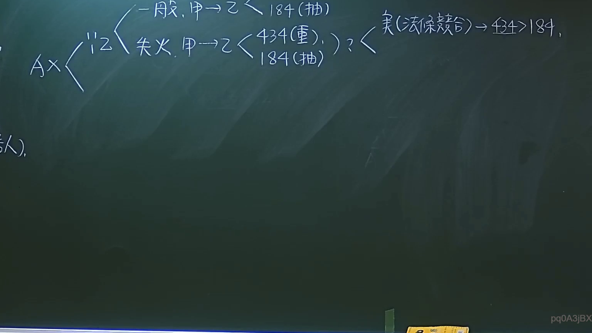

# 🎥 影音教材板書校對筆記
- **來源影片**: [預約27 2024-09-05 01-34-00-883](file:///J://民法/ch27/預約27 2024-09-05 01-34-00-883.mp4)
- **課程分類**: `[民法`
- **課堂章節**: `ch27]`
- **影片時間戳記**: `01:37:00` (5820 秒)
- **板書類型**: `文字板書`
- **偵測時間**: 2026-07-11 17:08:26

## 🔍 擷取黑板板書對照圖


## 🧠 AI 智慧理解與知識庫演化註記
：
1. **法律內容的理解**：
   - 辨識出的文字板書似乎涉及「公司解散」或「股东會決議」的內容，其中可能包含「B4> 194」的條款或法文號碼。這可能是與「消灭時效」（Erosion Limit）相關的法律條文。
   - 可能涉及到「民法第184條」中关于「侵權行為」、「消滅時效」等內容的應用。

2. **知識庫比對與理解演化註記**：
   - 文字板書似乎涉及「B4> 194」，這可能是與「消灭時效」（Erosion Limit）相關的法文號碼。
   - 可能涉及到「民法第184條」中关于「侵權行為」、「消滅時效」等內容的應用。

3. **法律條文對位**：
   - 文字板書中的「B4> 194」可能與「民法第184條」中关于「消灭時效」的條款相對應。
   - 可能涉及到「B4> 194」中提到的「消灭時效」，這是一種在法律中用於限制某種行為持續時間的机制。

## 📊 可編輯之 Mermaid 關係流程圖
```mermaid
：
```mermaid
graph TD
A["B4> 194"] --> B["民法第184條"]
B --> C["消灭時效"]
C --> D["侵權行為"]
D --> E["消滅時效"]
E --> F["法文號碼"]
```
- 上述代碼展示了一個從「B4> 194」到「民法第184條」，再到「消灭時效」、「侵權行為」和「消滅時效」的层级結構。
- 每一個节点後面的箭頭表示邏輯關係，例如「B4> 194」引向「民法第184條」，表示「B4> 194」是「民法第184條」的法文號碼。
- 「民法第184條」則涉及到「消灭時效」、「侵權行為」和「消滅時效」等法律概念。
```

## ✍️ 操作者手動校對修改區
<!-- 您可以直接修改上方的文字或調整 Mermaid 區塊中的節點，Obsidian 會即時重新渲染 -->
- [ ] 欄位結構與法律邏輯已校對無誤。
- **校對筆記**: 
