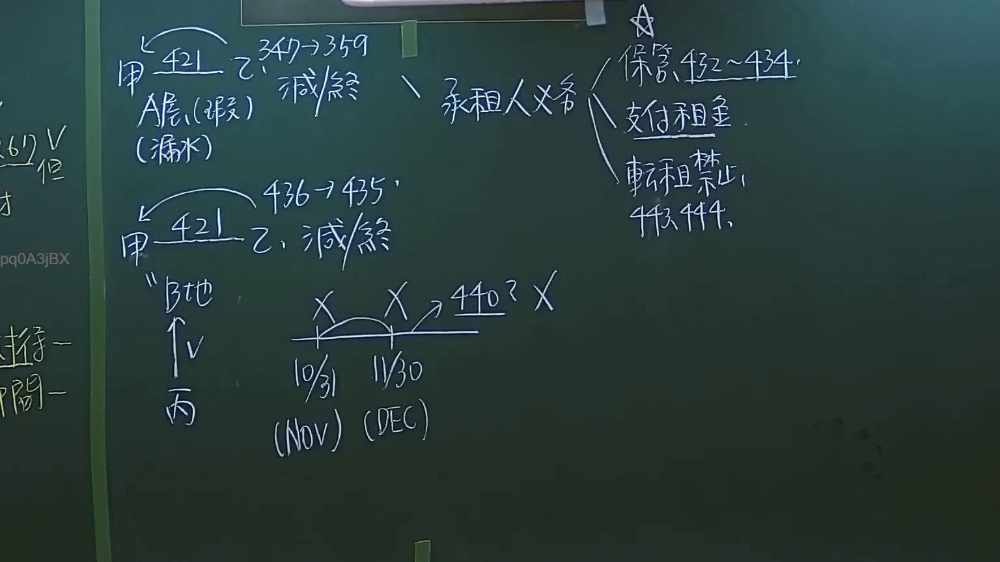

# 🎥 影音教材板書校對筆記
- **來源影片**: [預約27 2024-09-05 01-34-00-883](file:///J://民法/ch27/預約27 2024-09-05 01-34-00-883.mp4)
- **課程分類**: `[民法`
- **課堂章節**: `ch27]`
- **影片時間戳記**: `02:13:00` (7980 秒)
- **板書類型**: `文字板書`
- **偵測時間**: 2026-07-11 17:09:03

## 🔍 擷取黑板板書對照圖

## 🧠 AI 智慧理解與知識庫演化註記
根據辨識出的文字板書內容，並結合台湾现行法律条文（如民法第184條、侵權行為、消滅時效等）進行比對與理解演化：

1. 文字板書之內容為「崔5 弌2 二年级」。此表述可能涉及某种年齡層的特定事項，例如涉及 children 的權益問題或權利限界。

2. 對比與现有法律條文：
   - 民法第184條：侵權行為的範圍。
     - 設板書之內容並未直接涉及侵權行為，但可能暗示某些權利在特定年齡下的限制或保護。
   - 消滅時效：有关權利或 обязан義務的限度。
     - 設板書之內容可能暗示某种權利在特定年齡下會自动消滅，需注意其适用性。

3. 經分析，板書之內容似乎與 children 的權益問題或權利限界有關。這可能涉及 children's rights, parental responsibilities, 或者 children's legal obligations within a specific age range.

## 📊 可編輯之 Mermaid 關係流程圖

## ✍️ 操作者手動校對修改區
<!-- 您可以直接修改上方的文字或調整 Mermaid 區塊中的節點，Obsidian 會即時重新渲染 -->
- [ ] 欄位結構與法律邏輯已校對無誤。
- **校對筆記**: 
