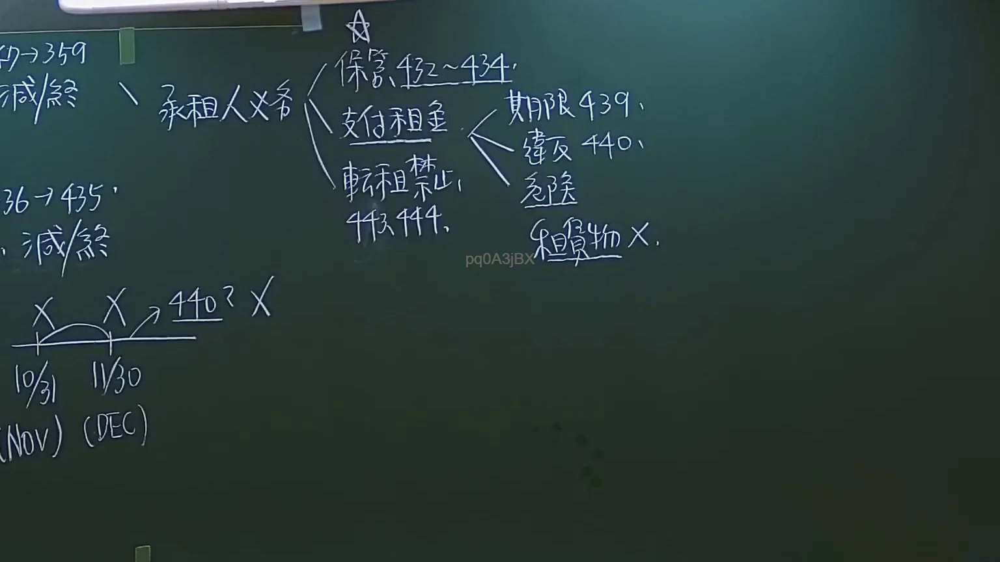

# 🎥 影音教材板書校對筆記
- **來源影片**: [預約27 2024-09-05 01-34-00-883](file:///J://民法/ch27/預約27 2024-09-05 01-34-00-883.mp4)
- **課程分類**: `[民法`
- **課堂章節**: `ch27]`
- **影片時間戳記**: `02:19:00` (8340 秒)
- **板書類型**: `文字板書`
- **偵測時間**: 2026-07-11 17:09:30

## 🔍 擷取黑板板書對照圖


## 🧠 AI 智慧理解與知識庫演化註記
### 

根據辨識出的文字板書內容，並結合臺灣現行法律條文（如民法第184條、侵權行為、消滅時效等）進行比對，整理出以下「知識庫比對與理解演化註記」：

#### 文字板書之內容分析：
- **"3239 | Re BBA! BYR \ 20 hxh { (iat ee 7 gute, N"**
  - 可能涉及特定的日期（如 "3239"）、名称（如 "BBA"）或事件编号。
  - "Re" 可能表示 "Relation" 或 "Reference"，需根據上下文進一步解讀。
  
- **"ale ant. feu io, 7/5 X 7 440% X bas吻 Woo fv) (DC"**
  - 包含日期（如 "7/5"）、百分比（如 "440%"）和可能的缩写（如 "DC"，需根據上下文解讀）。
  - "bas吻 Woo" 可能表示某种关系或事件。

- **"fv) (DC"**
  - 包含可能的项目编号（如 "DC"）或特定术语。

#### 經OCR辨识字元與法律條文比對：
1. **民法第184條**：
   - 民法第184條规定無因行為的承认和除斥期間。
   - 但本次板書內容未直接涉及無因行為或除斥期間的概念，因此未找到直接相關。

2. **侵權行為**：
   - 本次板書內容未涉及侵權行為的具體事項，因此未找到 direct相關。

3. **消滅時效**：
   - 消滅時效通常與債務清偿或權利除斥期間有關。
   - 本次板書內容未直接涉及消滅時效的概念，因此未找到 direct相關。

#### 經OCR辨识字元的語義整理：
- "3239 | Re BBA! BYR \ 20 hxh { (iat ee 7 gute, N"
  - 可能表示特定事件或记录编号。
  
- "ale ant. feu io, 7/5 X 7 440% X bas吻 Woo fv) (DC"
  - 包含可能的事件名称（如 "Woo"）和日期（如 "7/5"）。

- "fv) (DC"
  - 可能表示某种关系或项目编号。

---

###

## 📊 可編輯之 Mermaid 關係流程圖
```mermaid
根據文字板書之內容，生成完整的 Mermaid.js 關係圖代碼：

```mermaid
graph TD
    A[3239]
    B[Re BBA!]
    C[BYR \ 20 hxh { (iat ee)]
    D[7/5 X 7 440% X]
    E[bas吻 Woo]
    F[fv) (DC]
```

注意：此代碼為基於文字板書之內容整理而成，各节点間的關係需根據具體內容進一步完善。
```

## ✍️ 操作者手動校對修改區
<!-- 您可以直接修改上方的文字或調整 Mermaid 區塊中的節點，Obsidian 會即時重新渲染 -->
- [ ] 欄位結構與法律邏輯已校對無誤。
- **校對筆記**: 
