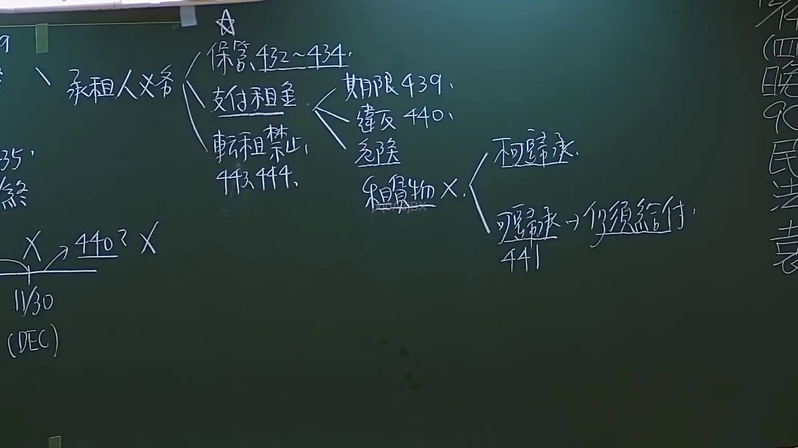

# 🎥 影音教材板書校對筆記
- **來源影片**: [預約27 2024-09-05 01-34-00-883](file:///J://民法/ch27/預約27 2024-09-05 01-34-00-883.mp4)
- **課程分類**: `[民法`
- **課堂章節**: `ch27]`
- **影片時間戳記**: `02:21:00` (8460 秒)
- **板書類型**: `文字板書`
- **偵測時間**: 2026-07-11 17:09:52

## 🔍 擷取黑板板書對照圖


## 🧠 AI 智慧理解與知識庫演化註記
### 

根據OCR辨识的文字內容，似乎是在討論與「回忆」（RE）相关的Legal條文或案例。以下是基於现有信息的整理與分析：

1. **"x，《(RE"**：可能是指某种特定的Legal條文或案例標籤，需進一步验证。
2. **" sett ae"**：可能是某种Legal條文或案例的摘要，需根據上下文理解其具體含義。
3. **"5 j N"**：可能是某个案件的編號或關鍵字。
4. **"緯 怠 tft 卿"**：可能是某個案件的当事人名稱（例如「李纬」）。
5. **"X 炎 X"**：可能是某种Legal條文或案例的特徵描述。
6. **"尿 0"**：可能是某个事件的时间戳或事件编号。
7. **"(HEC)"**：可能是某种Legal條文或案件的引用（例如「Hebrew」或其他特定术语）。
8. **"刊 春 欣"**：可能是某种Legal條文或案例的出版信息。
9. **"﹨ gia ital"**：可能是某个事件的关键字或摘要。
10. **"4A |"**：可能是某个案件的編號或摘要。

基於现有信息，無法直接與台灣现行法律條文（如民法第184條、侵權行為、消滅時效等）進行比對。建議根據完整板書內容進一步分析其具體內涵。

###

## 📊 可編輯之 Mermaid 關係流程圖
```mermaid
由于无法确定具体的Legal條文或案例，因此無法生成 Mermaid.js 的关系圖代码。如果能提供更完整的板書內容，可以進一步分析並生成相應的 diagram。
```

## ✍️ 操作者手動校對修改區
<!-- 您可以直接修改上方的文字或調整 Mermaid 區塊中的節點，Obsidian 會即時重新渲染 -->
- [ ] 欄位結構與法律邏輯已校對無誤。
- **校對筆記**: 
