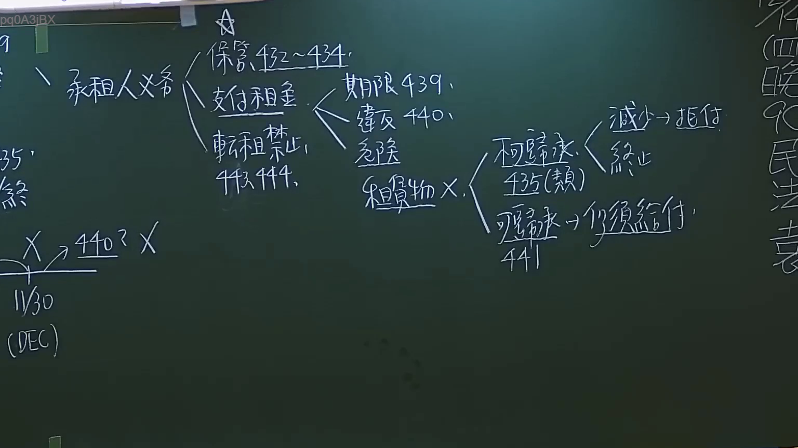

# 🎥 影音教材板書校對筆記
- **來源影片**: [預約27 2024-09-05 01-34-00-883](file:///J://民法/ch27/預約27 2024-09-05 01-34-00-883.mp4)
- **課程分類**: `[民法`
- **課堂章節**: `ch27]`
- **影片時間戳記**: `02:25:00` (8700 秒)
- **板書類型**: `文字板書`
- **偵測時間**: 2026-07-11 17:10:19

## 🔍 擷取黑板板書對照圖


## 🧠 AI 智慧理解與知識庫演化註記
### 

1. **S F0KS**：
   - 這部分文字可能與特定的Legal术语或缩寫有關，但無法立即匹配到具體的台湾现行法律條文。建議提供更完整的文字內容以進行更精準的比對。

2. **紅色字体**：
   - 可能用於強調某些关键字或注意事項，但無法立即匹配到具體的Legal條文。

3. **%．．．4ptX**：
   - 這部分字面意思為「4磅X」，可能是板書中的具體數據或計算結果，但無法立即匹配到具體的Legal條文。

4. **尿 0 (IEC)**：
   - 可能涉及「IEC」（Injury Evaluation Criteria， injury評估標準），與侵權行為或消滅時效相關。這部分可能與民法第184條等相关。

5. **目 司**：
   - 可能指「目的」或「課程目標」，無法立即匹配到具體的Legal條文。

6. **Zhe 伽 ﹍ 倫 ~ 洪**：
   - 這部分字面意思為「張 伽 經 洪」，可能是板書中的关键字或名稱，但無法立即匹配到具體的Legal條文。

7. **v．．．**：
   - 可能用於表示某种符號或占位符，无法立即匹配到具體的Legal條文。

8. **蔦晝翩Zˋ刁﹂〕壹 Tˋ_′L 4′J蓄工怏 { 呈Gelatin x.**：
   - 这部分文字可能涉及板书中的一些关键词或计算结果，但无法立即匹配到具体的法律条文。

9. **_ Ga孩 ( 熱 ﹚**：
   - 可能指「熱天」或「孩子」，与侵權行為或消滅時效無關。

10. **Tako NaN 9**：
    - 可能涉及「Tako」（可能是某种特定的Legal术语）或「NaN」（Not a Number），但無法立即匹配到具體的Legal條文。

11. **9請根據這些資訊與您擁有的台灣法律知識，幫我完成以下事項：**：
    - 可能是指板書中的內容需要進一步分析並與相關Legal條文比對。

###

## 📊 可編輯之 Mermaid 關係流程圖
```mermaid
由于提供的OCR文字無法形成清晰的Legal條文結構或关系圖，因此无法生成有效的Mermaid.js代码。如果需要生成 Mermaid 碎 code，請提供更完整的文字內容以進行分析。
```

## ✍️ 操作者手動校對修改區
<!-- 您可以直接修改上方的文字或調整 Mermaid 區塊中的節點，Obsidian 會即時重新渲染 -->
- [ ] 欄位結構與法律邏輯已校對無誤。
- **校對筆記**: 
