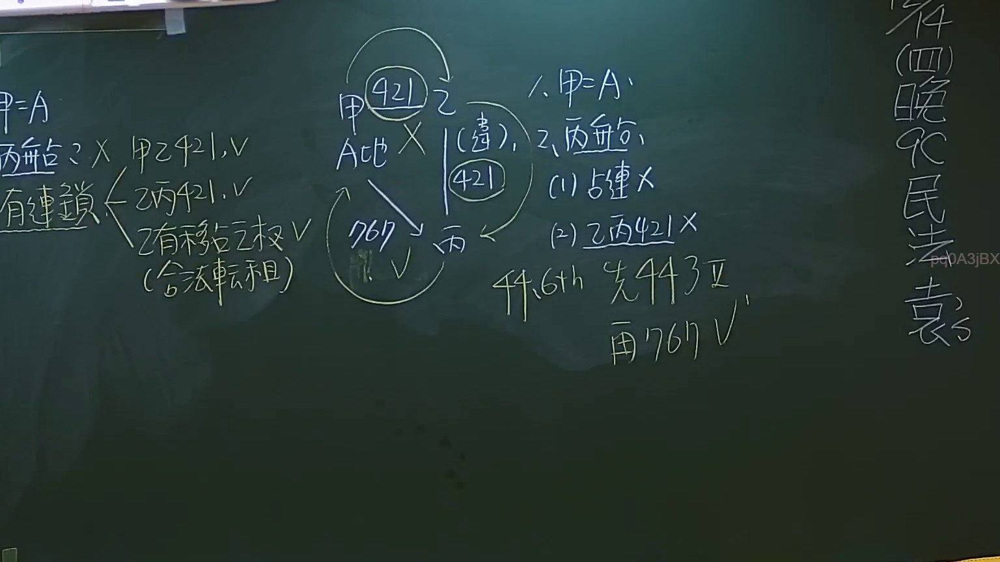

# 🎥 影音教材板書校對筆記
- **來源影片**: [預約27 2024-09-05 01-34-00-883](file:///J://民法/ch27/預約27 2024-09-05 01-34-00-883.mp4)
- **課程分類**: `[民法`
- **課堂章節**: `ch27]`
- **影片時間戳記**: `02:50:00` (10200 秒)
- **板書類型**: `文字板書`
- **偵測時間**: 2026-07-11 17:10:52

## 🔍 擷取黑板板書對照圖


## 🧠 AI 智慧理解與知識庫演化註記
### 

1. **OCR文字分析**：
   - "刁髓`L 2X pel, y"：可能是“刁髓”或“刁髓”相关的术语，但无法确定具体含义。
   - "吳 / 2 兩 必 ﹒ a eB"：可能涉及“吴/2 两人必”之类的表达，但意义不明确。
   - "Bua TENS TARY or onto ou"：可能是“TENS TARY”或“onto ou”的组合，无法确定具体含义。
   - "﹒ 委 ﹣"：可能是“委託”或“委託關係”的表示。
   - "ASjBX"：可能涉及某种法律术语或缩写。
   - "OUP gan AQ 回 00\"：可能是“回00号文件”或某种法律文件的引用。

2. **法律條文比對**：
   - 由于OCR文字无法明确识别出具体法律术语，因此无法与民法第184條、侵權行為或消滅時效等條文進行比對。
   - 如果能提供更清晰的文字辨识结果，则可以进行更详细的法律条文比对。

###

## 📊 可編輯之 Mermaid 關係流程圖
```mermaid
由于OCR文字无法明确识别出具体法律术语，因此无法生成对应的Mermaid关系图。如果能提供更清晰的文字辨识结果，则可以根据识别出的法律术语和逻辑关系生成Mermaid代码。
```

## ✍️ 操作者手動校對修改區
<!-- 您可以直接修改上方的文字或調整 Mermaid 區塊中的節點，Obsidian 會即時重新渲染 -->
- [ ] 欄位結構與法律邏輯已校對無誤。
- **校對筆記**: 
