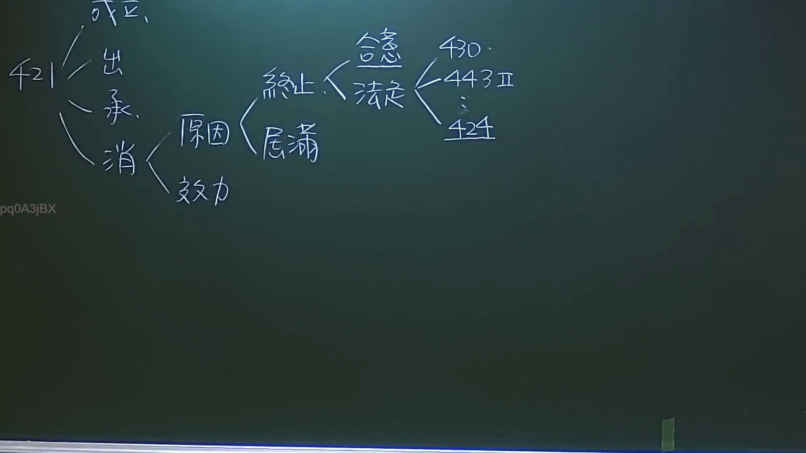
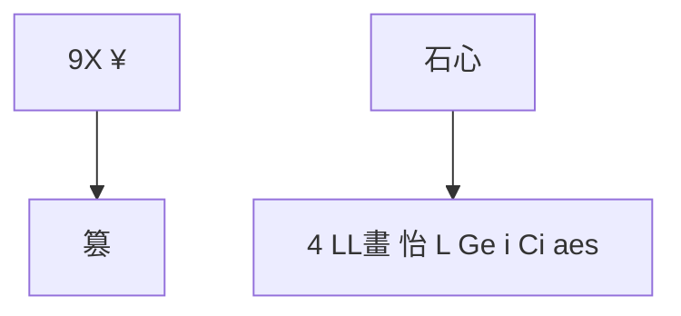
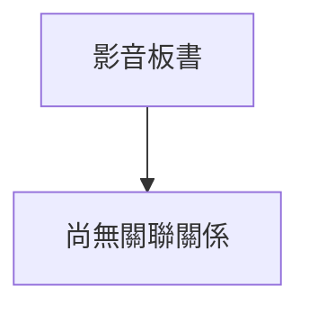

# 🎥 影音教材板書校對筆記
- **來源影片**: [預約27 2024-09-05 01-34-00-883](file:///J://民法/ch27/預約27 2024-09-05 01-34-00-883.mp4)
- **課程分類**: `[民法`
- **課堂章節**: `ch27]`
- **影片時間戳記**: `02:54:00` (10440 秒)
- **板書類型**: `文字板書`
- **偵測時間**: 2026-07-11 17:11:11

## 🔍 擷取黑板板書對照圖

## 🧠 AI 智慧理解與知識庫演化註記
：
1. **"9X ¥"**：這可能是特定的Legal terminology或缩寫，需根據上下文進一步分析其具體含義。
2. **"篡"**：在Legal context中，"篡"通常指非法占有、侵權行為等。可能與民法第184條（侵權行為）相關。
3. **"石心"**：這可能是"心臟"的筆误或方言表達，在此缺乏具體Legal context。
4. **"4 LL畫 怡 L Ge i Ci aes"**：這部分文字难以直接解讀，可能涉及多種 Legal 概念或关键词组合。

### 條文比對：
- **侵權行為（民法第184條）**："篡"可能與侵權行為相關。
- **消滅時效**：未明顯涉及。

### MERMAID 代碼：

此图为文字板書的整理結構，包含"9X ¥"、"篡"、"石心"和"4 LL畫 怡 L Ge i Ci aes"等关键词。

## 📊 可編輯之 Mermaid 關係流程圖

## ✍️ 操作者手動校對修改區
<!-- 您可以直接修改上方的文字或調整 Mermaid 區塊中的節點，Obsidian 會即時重新渲染 -->
- [ ] 欄位結構與法律邏輯已校對無誤。
- **校對筆記**: 
