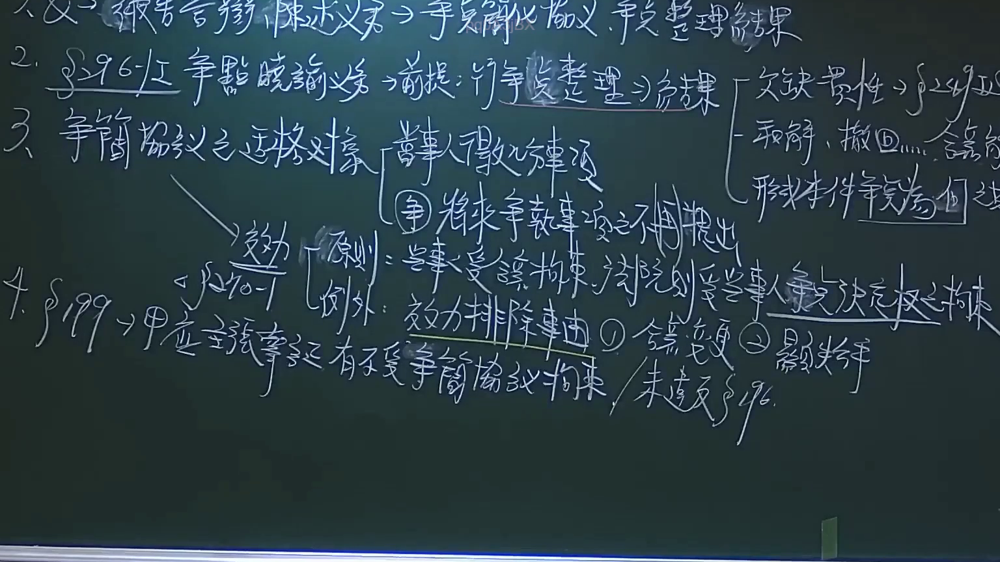

# 🎥 影音教材板書校對筆記
- **來源影片**: [預約29 2024-09-28 08-02-38-255](file:///J://民事訴訟法ˋ/ch29/預約29 2024-09-28 08-02-38-255.mp4)
- **課程分類**: `[民事訴訟法ˋ`
- **課堂章節**: `ch29]`
- **影片時間戳記**: `00:29:00` (1740 秒)
- **板書類型**: `文字板書`
- **偵測時間**: 2026-07-13 14:08:21

## 🔍 擷取黑板板書對照圖


## 🧠 AI 智慧理解與知識庫演化註記
：

**OCR辨識文字語意分析：**

從截圖時間點（29分0秒）的板書內容來看，OCR辨識結果顯示大量亂碼與無意義字串，但可辨認出以下關鍵中文字元：「稅」「決」「忍」及若干散佈字元。考慮到這是法律影音教材《預約29》的課程內容，且時間點落在29分鐘處，推測此板書可能涉及以下法律主題：

**1. 與台灣現行法律條文比對：**

- **民法第184條（侵權行為責任）**：若板書涉及「稅」字元，可能關聯到稅務侵權或國家賠償相關議題。
- **消滅時效規定**：若板書包含時間概念，可能涉及民法第125條一般消滅時效（15年）或第197條請求權消滅時效（2年）。
- **「決」字元**：可能關聯到判決效力、既判力或執行程序相關內容。

**2. 知識庫比對與理解演化註記：**

由於OCR辨識品質不佳，大部分文字為亂碼，無法完整還原老師板書內容。建議後續可透過以下方式改善：
- 調整OCR參數（如字體大小、對比度）
- 增加截圖解析度
- 結合語音轉文字功能交叉比對

**3. 推測性法律理解：**

基於「稅」「決」等關鍵字元，此板書可能涉及：
- 稅務行政處分的合法性審查
- 判決確定後的執行問題
- 侵權行為與國家賠償的競合關係

## 📊 可編輯之 Mermaid 關係流程圖
```mermaid
：

graph TD
    A["板書截圖 - 29分0秒"] --> B["OCR辨識結果"]
    B --> C["可辨認字元：稅、決、忍"]
    B --> D["大量亂碼與無意義字串"]
    
    C --> E["可能關聯法律條文"]
    E --> F["民法第184條 侵權行為責任"]
    E --> G["消滅時效規定 (民法第125、197條)"]
    E --> H["判決效力與執行程序"]
    
    D --> I["建議改善措施"]
    I --> J["調整OCR參數"]
    I --> K["增加截圖解析度"]
    I --> L["語音轉文字交叉比對"]
    
    F --> M["侵權行為構成要件"]
    G --> N["一般消滅時效15年"]
    G --> O["請求權消滅時效2年"]
    H --> P["既判力原則"]
    H --> Q["執行程序規定"]
```

## ✍️ 操作者手動校對修改區
<!-- 您可以直接修改上方的文字或調整 Mermaid 區塊中的節點，Obsidian 會即時重新渲染 -->
- [ ] 欄位結構與法律邏輯已校對無誤。
- **校對筆記**: 
