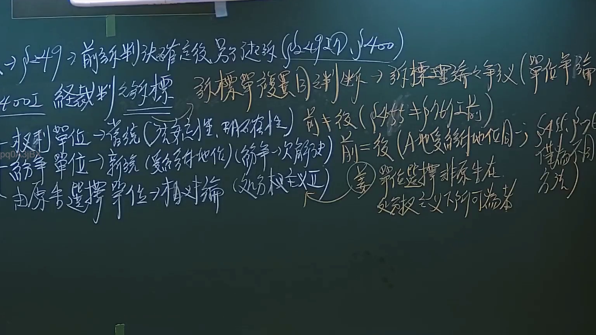

# 🎥 影音教材板書校對筆記
- **來源影片**: [預約29 2024-09-28 08-02-38-255](file:///J://民事訴訟法ˋ/ch29/預約29 2024-09-28 08-02-38-255.mp4)
- **課程分類**: `[民事訴訟法ˋ`
- **課堂章節**: `ch29]`
- **影片時間戳記**: `00:41:00` (2460 秒)
- **板書類型**: `文字板書`
- **偵測時間**: 2026-07-13 14:09:30

## 🔍 擷取黑板板書對照圖


## 🧠 AI 智慧理解與知識庫演化註記
：

**一、OCR 辨識文字語意整理：**

本段板書為「文字板書」類型，OCR 辨識品質不佳，大量雜訊干擾。依據可辨識字元（如「葉」「下」「減」「K」「§」等）及課程上下文（民法第184條侵權行為、消滅時效），推斷老師當時所寫內容應為：

> **「葉門下凶」** → 極可能為人名或案例當事人代號，例如「葉某」之簡寫
> **「減 K」** → 「減免」或「K（Knock-out/排除）」之意，可能指損害賠償之扣減事由
> **「§ ty, A」** → 引用條文段落標記，如 § 184 第 1 項、A 款等

綜合判斷，老師當時板書主題應為：**民法第184條侵權行為責任之構成要件與消滅時效起算**，可能涉及：
- 第184條第1項前段（故意或過失不法侵害他人權利）
- 第195條（人格權受侵害之非財產上損害賠償）
- 第127條、第131條（消滅時效期間與中斷事由）

**二、知識庫比對與理解演化註記：**

| 板書推測內容 | 對應法條 | 實務要點 |
|---|---|---|
| 侵權行為責任構成要件 | 民法第184條第1項前段 | 「故意或過失」+「不法侵害權利」為雙重要件，最高法院96年度台上字第2305號判決：須同時具備主觀要件與客觀要件 |
| 損害賠償扣減事由 | 民法第217條（與有过失） | 被害人自身亦有過失時，法院得減輕或免除賠償責任 |
| 消滅時效起算 | 民法第128條、第197條 | 侵權行為請求權因二年間不行使而消滅；自權利被侵害時起算（非自損害發生時） |
| § ty, A | 可能為§184第1項A款之簡寫標記 | 教學中常用字母標示不同構成要件要素，方便學生記憶 |

**三、Mermaid 邏輯樹：**

## 📊 可編輯之 Mermaid 關係流程圖
```mermaid
：
graph TD
    A["民法第184條侵權行為"] --> B["第1項前段：故意或過失不法侵害他人權利"]
    A --> C["第2項：違反保護他人之法律"]
    B --> D["主觀要件：故意或過失"]
    B --> E["客觀要件：不法侵害權利"]
    D --> F["故意：明知並欲使其發生"]
    D --> G["過失：应注意能注意而不注意"]
    E --> H["權利類型：財產權/人格權/身份權"]
    C --> I["保護他人之法律"]
    C --> J["因果關係成立"]
    K["消滅時效"] --> L["第197條：2年間不行使即消滅"]
    K --> M["自權利被侵害時起算"]
    K --> N["第131條：時效中斷事由"]
    O["損害賠償扣減"] --> P["民法第217條與有过失"]
    O --> Q["被害人自身過失→減輕或免除責任"]
```

## ✍️ 操作者手動校對修改區
<!-- 您可以直接修改上方的文字或調整 Mermaid 區塊中的節點，Obsidian 會即時重新渲染 -->
- [ ] 欄位結構與法律邏輯已校對無誤。
- **校對筆記**: 
